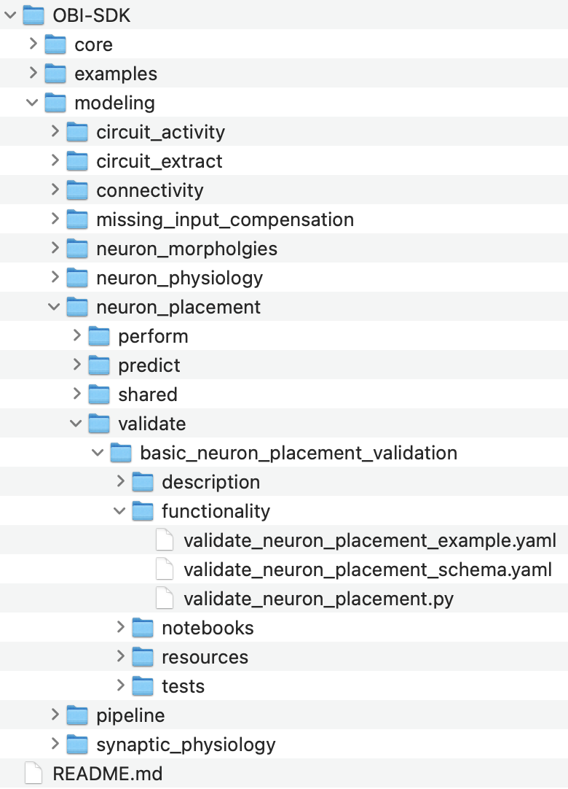
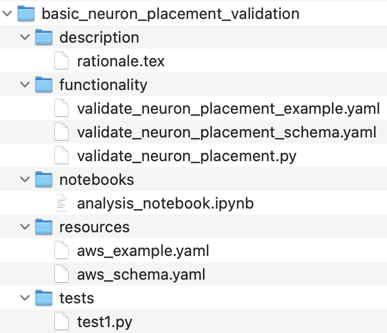
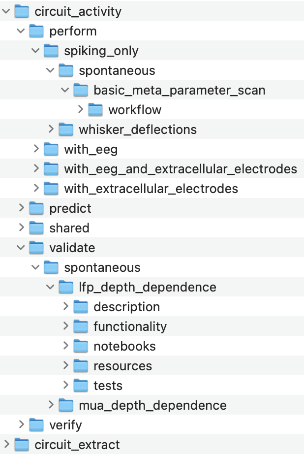

# 1. Library of Modeling Code
OBI-SDK organized by:
- A **LIBRARY of MODELING CODE organized HIERARCHICALLY** by:
    1. Modeling **STAGE** (i.e. neuron placement, network activity etc)
    2. Modeling **STEP** (i.e. perform, validate, predict). 

    Each modeling Step can have **multiple SUBSTEPS or alternative/complementary functions.**
    
    Each **Substep** is **defined** by a **single entry function** and **parameterization schema** (with an example parma config) in its own subdirectory:

    

    ---

- **Everything related to this SUBSTEP is then stored in the same location, including:**
    - **Tests**
    - **Descriptions/Rationale** (which can be rendered in the platform)
    - **Schemas for AWS/compute resources, and requirements**
    - **Notebooks.** Notebooks could also be generated automatically for library functions.

    

    ---

- **All modeling Stages and Steps including (for example) circuit building, extraction and simulation are organized in this way:**

    


    ---

- **Such standardization allows any step to be launched in the same way.**

    For example, passing **parameters** and **resources** config files to a Python script which then calls the rest API:
   ```bash
    run_aws.py \
    modeling/neuron_placement/validate/basic_neuron_placement_validation/functionality/validate_neuron_placement_example.yaml \
    modeling/neuron_placement/validate/basic_neuron_placement_validation/resources/aws_example.yaml
   ```
   Where the **parameters** config file specifies the **parameters, git branch/commit** and exact **function** to be run:
   ```yaml
   function: ./validate_neuron_placement.py
   branch: main
   commit: HEAD
   params: 
    output_data: ./neuron_placment/validate/basic_neuron_placement
    proportion_of_cells: 0.2
   ```
   And the **resources** config file specifies the AWS resources:
   ```yaml
   nodes: 1
   cores_per_node: 4
   persistance_root: openbluebrain.s3.us-west-2.amazonaws.com.....
   project: sscx_v2
   user: smith
   ```

    Calling **run_aws** might **commit and push** existing code (if required) and **call the rest API** (PUSH, passing the two configuration files). 
    
    The **service** then **launches the function** using the correct **commit for each step** and the **specified / appropriate resource.**

    ---

- **PIPELINES of Stages and Steps can then be defined in Pipeline config files** which point to different stage/step configuration files:
    ```yaml
    project: "SSCx_v2"
    aws_persistance_root: ""

    stages:
        neuron_placement: 
            perform: ...
            validate:
                basic_neuron_placement_validation:
                    root: "./modeling/neuron_placement/validate/basic_neuron_placement_validation/"
                    functionality: functionality/validate_neuron_placement_example.yaml
                    resources: resources/aws_example.yaml
            predict: ...

        connectivity:
            peform: ...
            validate: ...
            predict: ...
   ```

---