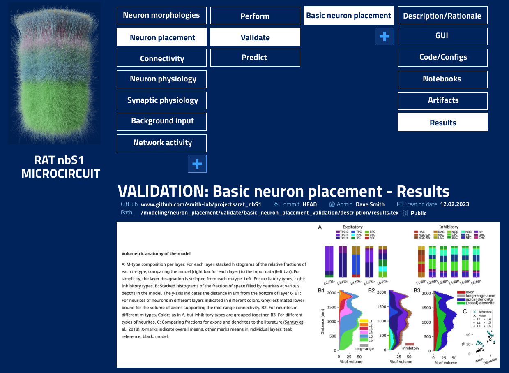
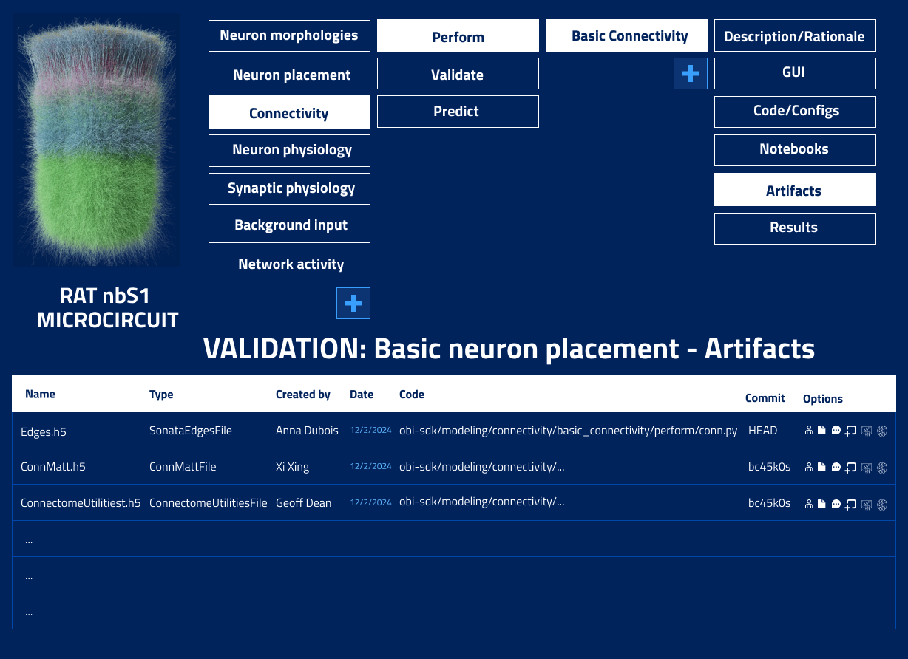

# 4. Platform

Any **project** created through the platform has a direct correspondence with the proposed **GitHub** project structure, and vice versa. 

Under this organization, the Platform can offer:

- **An entry point for new users to generate projects, parameterize configuration files, build pipelines.** 

    The GUI offers both:
    - 1. Simple form based parameterization of configuration files based on the schema of any OBI-SDK library function.
    - 2. More advanced custom GUI elements for parameterizing configuration files (i.e. existing single cell).

    ---

- **Automatic generation of project GitHub repository. Clear correspondence between code and GUI elements.**

- **Clear, general and hierarchical organization and navigation of complex multifaceted models.** 

    The hierachical organization of the modeling library and user projects corresponds with easy navigation in the Platform through:
    - Projects
    - Stages
    - Steps, for which there are corresponding:
        - GUI elements
        - Code
        - Artifacts
        - Description of:
            - Building steps
            - Rationale
            - Validations and discrepencies
            - Predictions

    
    This has huge benefits for the communication of models; both for potential users and peer reviewers. 
    
    Currently both groups have to dive into many recent and historic publications and code bases to understand these aspects.

    

    
---

- **Management/visualisation of data entities**

    All entities associated with a project are visible and can be managed or genereated through the platform:

    

---