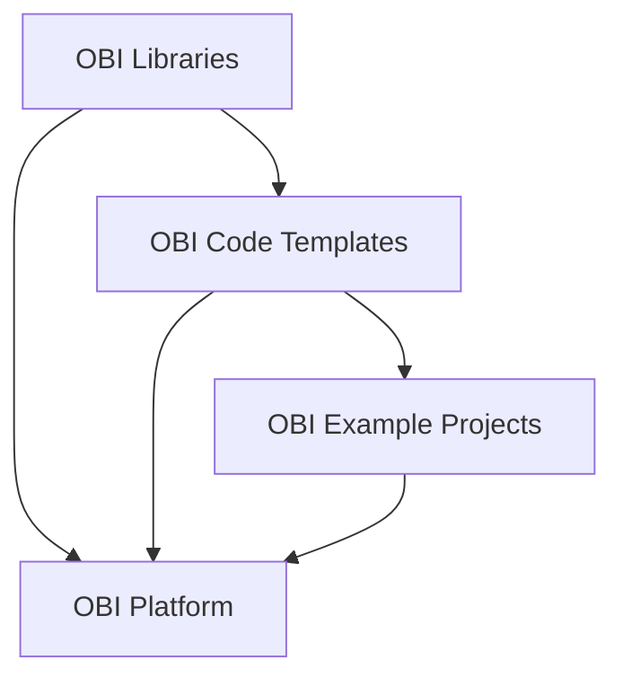

# Scientific Proposal For General OBI Code Organization - Goals & Proposal
- Here we define the **goals** and an initial **proposal** for a general organization of OBIs software.
- This aims to provide a basis for discussions and the potential prototyping of a general data and code organization.

## Goals

- **General framework for advancing the field of Simulations Neuroscience, which the platform builds on top of.** As the platform is essentially a code generator, executer and data manager, it will benefit most if the structure of the underlying code base is ideal in itself for advancing the field of Simulations Neuroscience. A framework to collate, organize, standardize and run all key building, optimizations, simulations, validations and analyses (and their associated dependencies).** As the platform is essentially a code generator, executor and data manager, the code for any platform functionality must first be collated. By collating all important functionalities, we also see what are the 'core' use cases. Any functionality we can collate the code for and make runnable on the cloud, we can also in theory generate income, before it is even GUI-fied. Iterative refinement, efficiency, flexibility, description of data/methods, collaboration

- **Compartmentalization of Modelling into compositional Stages and Steps with standardized interface.** All models are built, validated and used for making predictions in a sequential or parralel series of clearly defined **Modelling Stages** (i.e. neuron morphology generation, neuron placement, connectivity, ..., network activity, ... etc. At each Stage, there can be a combination of the following **Modelling Steps**: building, optimization of parameters, validation/discrepencies with real data, predictions, use cases. Making this clear demarcation of Stages and Steps and standardizing the interface for executing different components is essential to:
    1) The composition of different Stages and Steps for new Projects/Models.
    2) Clear correspondence between code and UI elements.
    3) Naturally communicating/teaching the generic Stages and Steps in Simulations Neuroscience.
    4) Having a clear correspondence between code and GUI functionality.
    5) Reusing code and UI elements for different Steps of the same Stage (for example, validation and predictions from connectivity).
 
- **Standardization and iteration of the communication of complex multifaceted models (including details, rationale, validations and use cases). Information in this standard format can be rendered in the platform, with the structure of the standard naturally teaching the user about existing models/data and the key parts of Simulations Neuroscience.** Communication is essential to convincing and eductating potential paying users, peer reviewers and the rest of the scientific community about our models and their value. Currently large collections of interelated scientific papers jointly describe details, rationale, validations and use cases, demanding huge time investment to learn at a high level. Standardization of how models and components are communicated is also essential for avoiding re-use in the platform. Moreover, such descriptions take months or years to achieve (historically for papers) through iterative refinement. Moreover, when models build/iterate upon previous models, descriptions should be inherited and adjusted.

- **Generality to decouple the contents that scientists can manage and the technical side managed by the engineering team.** Such a framework can rapidly allow us to collate existing code into usable features.

- **Version control of user code which has clear correspondence with persistence of generated artifacts.** Customers paying large sums of money want to access to the exact code they are running because 1) most journals now demand the publication of source code, 2) to understand what it is exactly they might pay for and/or have paid for. Version control of code/generated code is also essential for users.

- **Standardize the organization of code, data and descriptions for use by LLMs.** The standardization of modelling Stages and Steps, with corresponding code and descriptions is well suited for LLMs.

- **A framework for collaboration combining cloud compute and burst-out to institution supercomputers.** The development, improvement and use of our models is extremely expensive in terms of compute and human time. Moreover, it remains a highly experimental process: unexpected issues (both engineering and scientific) are very common, meaning that code (including building, optimization, simulation and analysis) must often be rerun many times to attain a relevant result. Many labs and experts around the world have access to compute and may not currently have funds for cloud compute. The peer review process is also highly demanding, with reviewers expecting models to hugely advance the state of the art. For now, the complexity of our models demands a much wider community of neuroscientists to engage in the development and advancent of models, and the development process to be more structured. A compartmental GitHub-based structuring with SQL/AWS persistence would allow simple management of model development and validation, with clear Stages and Steps, some of which could be assigned for burst-out compute across the world.

- **A general GitHub based standard for cloud deployment (and busrt-out to university supercomputers in future) of brain models and analyses, with inherited integration into the platform.** Such a standard could also be used for the models of other groups, with descriptions, rationale etc of different Stages and Steps automatically being rendered in the platform.

- **Cloud deployment enables easy reproducibility.** Being able to publish a paper with code that anyone can easily run and recreate on the cloud would be very attractive to scientists; particularly because citations often come from the ability to extend/re-use work.

- **Potential/eventual generality for any neuroscience use-case.** Such an organization of code, compute and persistance would provide a powerful framework for scienctists.

- **Code/configuration files for launching on AWS with each piece of code.** Anyone browsing the code can easily launch it on AWS and start spending $.

- **Confirmation of expected behaviour.** As scientists, we can rerun building, optimizations, simulations etc and verify expected behaviour.

- **High scientific flexibility.** Science advances through trial and error so the platform should enable fast iteration on analyses etc.

- **Users can contribute code to a project or general code library**

- **Maximize code generality/reusability.** Code must be re-usable across models and different simulations. Users should also see a path for converting there existing code to a general piece of code that others can re-use.

## Proposal
Taking into account all of these considerations, we make the following proposal for discussion and iteration. To begin we suggest the following demarcation organization:

## OBI Libraries
[OBI Libraries](https://www.github.com/james-isbister/OBI-Libraries) are the OBI maintained libraries / packages i.e. Neuron, CoreNeuron, BlueETL, BluepySnap, etc.

## OBI Code Templates
1) [OBI Code Templates](https://www.github.com/james-isbister/OBI-Code-Templates) are generalizable pieces of code which use code in OBI Libraries (and beyond) for building, optimizing parameters, validating and characterizing discrepencies with laboratory data, making predictions, and running other use cases.

2) Templates read in parameters or contain placeholders (e.g. for notebooks), for input and output data paths and other parameters. These are populated by values from configuration files (json).

3) Templates exist with example configuration files and the necessary AWS scripts for launching them.

4) Templates exist with 

5) Templates are organized by Modelling Stage (i.e. neuron morphology generation, neuron placement, connectivity, ..., network activity, ... etc.) and Modelling Step (i.e. building, optimization of parameters, validation/discrepencies with real data, predictions, use cases), 

6) Templates are compositional...

7) Similar to the concept of bbp-workflow perhaps, except code functions are 

## OBI Project Examples
1) [OBI Project Examples](https://www.github.com/james-isbister/OBI-Project-Examples) contains a list of configurations files for different OBI Templates

2) Projects have high level json configs defining (serial and parallel) order of Stages (which are in subdirectories)

3) Each Stage has a json config defining (serial and parallel) order of Steps

4) Each Step has a json config defining the parameters of its code

## OBI User Projects
[OBI User Projects](https://www.github.com/james-isbister/OBI-User-Projects)

1) Each User has a set of Projects, with each Project being a seperate GitHub repository.

2) User Projects may be forks of Templates or Examples.

## OBI Database and Persistence
[OBI Database and Persistence](https://www.github.com/james-isbister/OBI-Database-and-Persistence) is the Everything is built on top of a database

## OBI Platform
[OBI Platform](https://www.github.com/james-isbister/OBI-Platform) 

## Overview Diagram

## Outstanding questions
- What is the best/cleanest way of having 

