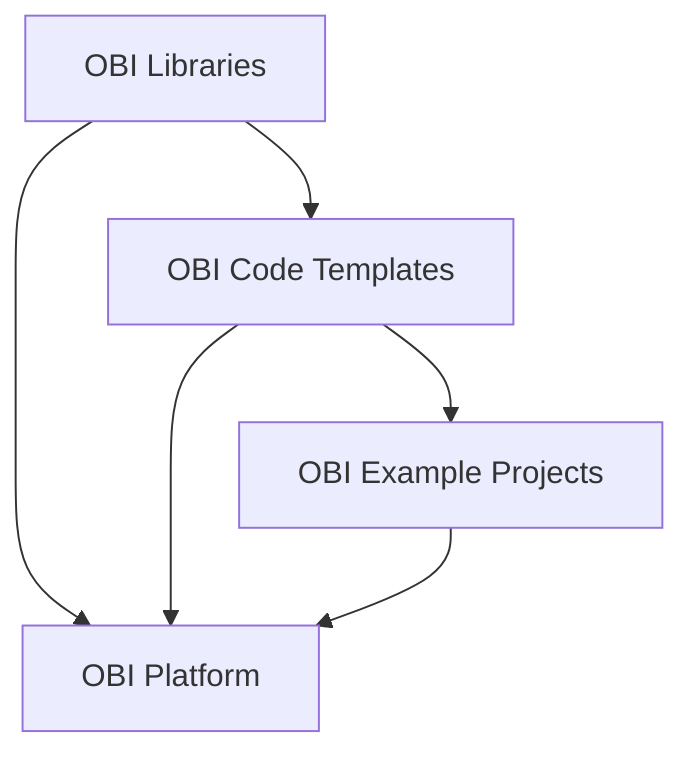

# Scientific Proposal For General OBI Code Organization - Example as a basis for discussions & refinement
This example proposes a general organization for OBIs software. The focus here is not on the specifics of a technical implementation or terminology but on eventually finding a general organization of data and code, which achieves the following goals:

## Goals

- **Ideal code framework for Simulations Neuroscience which the platform builds on top of.**

- **Compartmentalization of Modelling into compositional Stages and Steps with standardized interface.** All models are built, validated and used for making predictions in a sequential or parralel series of clearly defined **Modelling Stages** (i.e. neuron morphology generation, neuron placement, connectivity, ..., network activity, ... etc. At each Stage, there can be a combination of the following **Modelling Steps**: building, optimization of parameters, validation/discrepencies with real data, predictions, use cases. Making this clear demarcation of Stages and Steps and standardizing the interface for executing different components is essential to:
    1) The composition of different Stages and Steps for new Projects/Models.
    2) Naturally communicating/teaching the generic Stages and Steps in Simulations Neuroscience.
    3) Having a clear correspondence between code and GUI functionality.
    4) Reusing code and UI elements for different Steps of the same Stage (for example, validation and predictions from connectivity).
 
- **Standardization and iteration of the communication of complex multifaceted models (including details, rationale, validations and use cases). Information in the standard format can be rendered in the platform in a clear format which naturally teaches the user about existing models/data and the key parts of Simulations Neuroscience.** Communication is essential to convincing and eductating potential paying users, peer reviewers and the rest of the scientific community about our models and their value. Currently large collections of interelated scientific papers jointly describe details, rationale, validations and use cases, demanding huge time investment to learn at a high level. Standardization of how models and components are communicated is also essential for avoiding re-use in the platform. Moreover, such descriptions take months or years to achieve (historically for papers) through iterative refinement. Moreover, when models build/iterate upon previous models, descriptions should be inherited and adjusted.

- **Rendering A standard format can be iter which can be iterated on is critical to developing good communication of our models.

- **Naturally teaches the key parts of Simulations Neuroscience** The standardization of how we communicate 

- **Code/configuration files for launching on AWS with each piece of code.**

- **Generality to decouple the contents that scientists can manage and the technical side managed by the engineering team.** Such a framework can rapidly allow us to collate existing code into usable features.

- **Clear correspondence between persistence of generated artifacts and version control of associated code.** Customers paying large sums of money want to access to the exact code they are running because 1) most journals now demand the publication of source code, 2) to understand what it is exactly they might pay for and/or have paid for.

- **Leverages the advantages of source control.**

- **Builds clear correspondence between code and UI elements.**

- **Standardizes the organization of code, data and descriptions for use by LLMs.**

- **Confirmation of expected behaviour.** As scientists, we can rerun building, optimizations, simulations etc and verify expected behaviour.

- **A framework for future international collaboration combining cloud compute and burst-out to institution supercomputers.** Lots of users/experts with access to compute. If we remember just how much compute was needed to run build, optimize, validate the full SSCx model, we are probably in the millions of dollars or even 10s of millions of dollars on AWS.

- **A general GitHub based standard for cloud deployment (and busrt-out to university supercomputers in future) of brain models and analyses, with inherited integration into the platform.**

- **Enables reproducibility with easy cloud deployment.** 

- **Potential generality for any neuroscience use-case**

- **Enable high scientific flexibility.** Science advances through trial and error so the platform should enable fast iteration on analyses etc.

- **Maximizes code reusability.** 

- **Learn lessons of our joint scientific experience** our scientific experience of model development, validation, leveraging models to make predictions, peer review.

- **Iterative refinement, efficiency, flexibility, description of data/methods, collaboration, which the platform can be built on top of.**

- **A framework to collate, organize, standardize and run all key building, optimizations, simulations, validations and analyses (and their associated dependencies).** As the platform is essentially a code generator, executor and data manager, the code for any platform functionality must first be collated. By collating all important functionalities, we also see what are the 'core' use cases. Any functionality we can collate the code for and make runnable on the cloud, we can also in theory generate income, before it is even GUI-fied.

- **Provide a basis for users/scientists to first contribute code for a particular model/dataset, but then convert it to more generally applied analysis.**

## Proposal
As an initial proposal for discussion, we propose the following demarcation organization:

## OBI Libraries
[OBI Libraries](https://www.github.com/james-isbister/OBI-Libraries) are the OBI maintained libraries / packages i.e. Neuron, CoreNeuron, BlueETL, BluepySnap, etc.

## OBI Code Templates
1) [OBI Code Templates](https://www.github.com/james-isbister/OBI-Code-Templates) are generalizable pieces of code which use code in OBI Libraries (and beyond) for building, optimizing parameters, validating and characterizing discrepencies with laboratory data, making predictions, and running other use cases.

2) Templates read in parameters or contain placeholders (e.g. for notebooks), for input and output data paths and other parameters. These are populated by values from configuration files (json).

3) Templates exist with example configuration files and the necessary AWS scripts for launching them.

4) Templates exist with 

5) Templates are organized by Modelling Stage (i.e. neuron morphology generation, neuron placement, connectivity, ..., network activity, ... etc.) and Modelling Step (i.e. building, optimization of parameters, validation/discrepencies with real data, predictions, use cases), 

6) Templates are compositional...

7) Similar to the concept of bbp-workflow perhaps, except code functions are 

## OBI Project Examples
1) [OBI Project Examples](https://www.github.com/james-isbister/OBI-Project-Examples) contains a list of configurations files for different OBI Templates

2) Projects have high level json configs defining (serial and parallel) order of Stages (which are in subdirectories)

3) Each Stage has a json config defining (serial and parallel) order of Steps

4) Each Step has a json config defining the parameters of its code

## OBI User Projects
[OBI User Projects](https://www.github.com/james-isbister/OBI-User-Projects)

1) Each User has a set of Projects, with each Project being a seperate GitHub repository.

2) User Projects may be forks of Templates or Examples.

## OBI Database and Persistence
[OBI Database and Persistence](https://www.github.com/james-isbister/OBI-Database-and-Persistence) is the Everything is built on top of a database

## OBI Platform
[OBI Platform](https://www.github.com/james-isbister/OBI-Platform) 

## Overview Diagram

## Outstanding questions
- What is the best/cleanest way of having 

