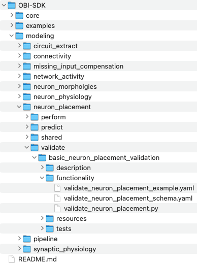
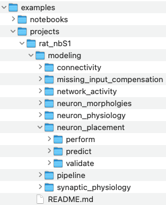
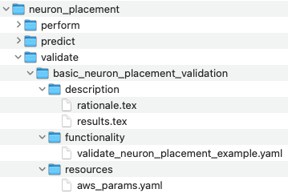
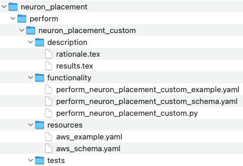

# Scientific Proposal For General OBI Code Organization - Goals & Proposal
- Here we define the **goals** and an initial **proposal** for a general organization of code and data, which can:
    - **Maximise the scientific utility of the Platform**
    - **Accelerate the field of Simulations Neuroscience**
- The aim is to provide a basis for discussions, iteration and the potential prototyping of a general data and code organization.


# Proposal
Taking into account these considerations, we make the following proposal for discussion and iteration. The general idea is to have a single SDK for using BBP libraries with AWS, SQL persistance and version control. The SDK can be used both directly by users and by the platform.

## OBI-SDK
OBI-SDK organized by:
- A **library of modeling code organized by modeling stage (i.e. neuron placement, network activity etc), and modeling steps (i.e. perform, validate, predict)**. Each modeling step can have **multiple substeps or alternative approaches** each defined by a single function in its own subdirectory, and each with a corresponding schema for parameterization:

    


- **Standardization allows any step to be launched in the same way**: passing a **parameters** configuration file and a **resources** configuration file to a python script which then makes a call to the rest API, for example:
   ```bash
    run_aws.py \
    modeling/neuron_placement/validate/basic_neuron_placement_validation/functionality/validate_neuron_placement_example.yaml \
    modeling/neuron_placement/validate/basic_neuron_placement_validation/resources/aws_example.yaml
   ```
   where the **parameters** configuration file specifies the parameters and exact function to be run:
   ```yaml
   function: ./validate_neuron_placement.py
   branch: main
   commit: HEAD
   params: 
    output_data: ./neuron_placment/validate/basic_neuron_placement
    proportion_of_cells: 0.2
   ```
   and the **resources** configuration file specifies the aws resources:
   ```yaml
   nodes: 1
   cores_per_node: 4
   persistance_root: openbluebrain.s3.us-west-2.amazonaws.com.....
   project: sscx_v2
   user: smith
   ```

    This might commit and push existing code (if required) and call the rest API (PUSH, passing the two configuration files). The service then launches the code (using the correct commit for each step) on the specified / appropriate resource.


- **Sequences of stages and steps can then be defined in pipeline configuration files** which point to different stage/step configuration files:
    ```yaml
    project: "SSCx_v2"
    aws_persistance_root: ""

    stages:
        neuron_placement: 
            perform: ...
            validate:
                basic_neuron_placement_validation:
                    root: "./modeling/neuron_placement/validate/basic_neuron_placement_validation/"
                    functionality: functionality/validate_neuron_placement_example.yaml
                    resources: resources/aws_example.yaml
            predict: ...

        connectivity:
            peform: ...
            validate: ...
            predict: ...
   ```

- **Example/user projects use a similar structure to the modeling library, with a seperation into Stages and Steps, and one or multiple pipelines.**

    


- **Then for a single Step: configuration files, latex files and resource parameterizations keep a single structure to that of the modeling library:**

    

    Here the Step configuration file could point to the sdk function:
    ```yaml
    function: obi-sdk/modeling/neuron_placement/validate/basic_neuron_placement_validation/validate_neuron_placement.py
    params: 
        output_data: ./neuron_placment/validate/basic_neuron_placement
        proportion_of_cells: 0.2
   ```

- **Users can also add custom code within this structure:**

    

    And point to these functions rather the SDK in the configuration file:
    ```yaml
    function: rat_nbs1/modeling/neuron_placement/validate/basic_neuron_placement_validation/perform_neuron_placement_custom.py
    params: 
        output_data: ./neuron_placment/validate/basic_neuron_placement
        proportion_of_cells: 0.2
   ```

- **Custom code could also be collated in forks of the SDK, which would allow pull requests to be made into the main branch later.**

- **As has been seen, tests and descriptions (rationale/descriptions/results) for different Steps can also be organized in the same hierarchical structure (both in the SDK and project).**


- **Input and output artifacts for each function all comply with our new SQL schema.** It might be beneficial to store the schema in the same repository so that users can add functionality without having to sync two seperate repositories (syncing seperate repos may seem challenging / risky to low/medium skill git users):

- **Artifacts produced by a project are then stored with the same organization into Stages and Steps.**

- **All persistance and usage of artifacts is standardized**

# Platform

The platform then has a direct correspondence with the version controlled modeling library and each project


<!--
## OBI Interface
- Single Python API for using functionality of all OBI Libraries
- Library of functions which return persistable 
- Jupyter notebooks generated automatically to display
-->

<!--
## OBI Libraries
OBI Libraries are the OBI maintained libraries / packages i.e. Neuron, CoreNeuron, BlueETL, BluepySnap, etc.
-->

 
<!--
## OBI Project Examples
1) [OBI Project Examples](./OBI-Project-Examples) contains a list of configurations files for different OBI Templates
2) Projects have high level json configs defining (serial and parallel) order of Stages (which are in subdirectories)
3) Each Stage has a json config defining (serial and parallel) order of Steps
4) Each Step has a json config defining the parameters of its code
-->

As an example of a project we consider the rat nbS1. We begin by assuming that everything can be d


 
<!--
## OBI Code Templates
1) [OBI Code Templates](./OBI-Code-Templates) are generalizable pieces of code which use code in OBI Libraries (and beyond) for building, optimizing parameters, validating and characterizing discrepencies with laboratory data, making predictions, and running other use cases.

2) Templates read in parameters or contain placeholders (e.g. for notebooks), for input and output data paths and other parameters. These are populated by values from configuration files (json).

3) Templates exist with example configuration files and the necessary AWS scripts for launching them.

4) Templates exist with 

5) Templates are organized by Modelling Stage (i.e. neuron morphology generation, neuron placement, connectivity, ..., network activity, ... etc.) and Modelling Step (i.e. building, optimization of parameters, validation/discrepencies with real data, predictions, use cases), 

6) Templates are compositional...

7) Similar to the concept of bbp-workflow perhaps, except code functions are 
-->


<!--
## OBI User Projects
[OBI User Projects](./OBI-User-Projects)

1) Each User has a set of Projects, with each Project being a seperate GitHub repository.

2) User Projects may be forks of Templates or Examples.

## OBI Platform
[OBI Platform](./OBI-Platform) 

## OBI Database and Persistence
[OBI Database and Persistence](./OBI-Database-and-Persistence) is the Everything is built on top of a database
-->

