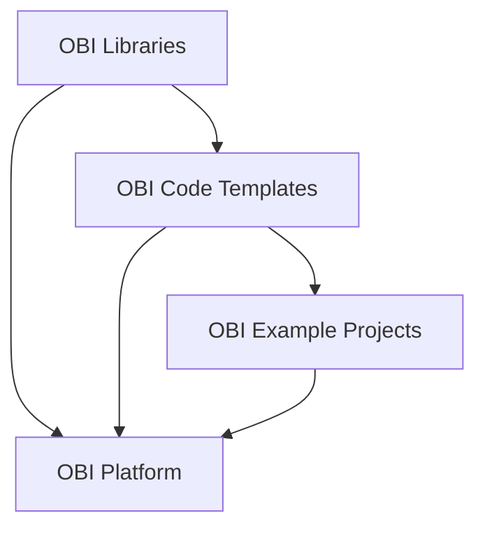

# Scientific Proposal For General OBI Code Organization - Example as a basis for discussions & refinement
This example proposes a general organization for OBIs software. The focus here is not on the specifics of a technical implementation or terminology but on eventually finding a general organization of data and code, which achieves the following goals:

- **Compartmentalization of Modelling into compositional Stages and Steps.** All models are built, validated and used for making predictions in a sequential or parralel series of clearly defined **Modelling Stages** (i.e. neuron morphology generation, neuron placement, connectivity, ..., network activity, ... etc. At each Stage, there can be a combination of the following **Modelling Steps**: building, optimization of parameters, validation/discrepencies with real data, predictions, use cases. Making this clear demarcation of Stages and Steps is essential to:
    1) The composition of different Stages and Steps for new Projects/Models
    2) Clearly communicating/teaching the generic Stages and Steps in Simulations Neuroscience,
    3) Having a clear correspondence between code and GUI functionality,
    4) Standardizing for 
    5) reusing code and UI elements for different steps of the same stage (for example, validation and predictions from connectivity).

- **A framework to collate, organize, standardize and run all key building, optimizations, simulations, validations and analyses (and their associated dependencies).** As the platform is essentially a code generator, executor and data manager, the code for any platform functionality must first be collated. By collating all important functionalities, we also see what are the 'core' use cases. Any functionality we can collate the code for and make runnable on the cloud, we can also in theory generate income, before it is even GUI-fied.

- **A framework which targets iterative refinement, efficiency, flexibility, description of data/methods, collaboration, which the platform can be built on top of.**

- **Optimise communication of complex multifaceted models (including details, rationale, validations and use cases).** Communication is essential to convincing potential paying users, peer reviewers and the rest of the scientific community of the value of our models. It is also essential to rapidly educate potential users. Currently large collections of interelated scientific papers jointly describe details, rationale, validations and use cases. Basically, only Blue Brain employees could afford to invest the time to learn about a subset of the different components with the potential of a future pay-off. Even then, this would only give a birds eye view of many of the components. Moreover, such descriptions take months or years to achieve through iterative refinement. Moreover, when models build/iterate upon previous models, descriptions should be inherited and adjusted.

- **Generality to decouple the technical side (engineering team) from the contents that scientists can and should manage.** Such a framework

- **Provides a framework for future international collaboration combining cloud compute and burst-out to institution supercomputers.** Lots of users/experts with access to compute. If we remember just how much compute was needed to run build, optimize, validate the full SSCx model, we are probably in the millions of dollars or even 10s of millions of dollars on AWS.

- **Create a GitHub based standard for cloud deployment (and busrt-out to university supercomputers in future) of brain models and analyses, that can then be integrated in the platform.**

- **Enable high scientific flexibility.** Science advances through trial and error, and the ability to quickly try different things. The platform should

- **Leverages the advantages of source control.**

- **Unify persistence of artifacts with version control of associated code.** Customers paying large sums of money want to access to the exact code they are running because 1) most journals now demand the publication of source code, 2) to understand what it is exactly they have paid for.

- **Code exixts with the AWS scripts/bbp-workflow for launching code**

- **Enables reproducibility.** Code 

- **Standardizes the organization of code and data for use by LLMs.**

More:
- **Efficiency in re-use of code.** 
- **Lower the barrier of entry**
- **Learns lessons of scientific experience** our scientific experience of model development, validation, leveraging models to make predictions, peer review.
- **Considers the realitites of the large scale compute required to build + validate large scale models**
- **Enables iterative refinement of large scale models by the community**

- **Enables clear communication of complex models**

- **De-couples the provision of content** 
- **Organizes code into clear scientific stages**
- **Naturally teaches the key parts of Simulations Neuroscience**
- **Maximizes code reusability**
- **Enables the user to see the code of the expensive simulations they have run**
- **Eventually enables global collaboration on projects**
- Builds an association between
- Enables scientists to add code.
- Builds a correspondence between code

As an initial proposal for discussion, we propose the following demarcation organization:

## OBI Libraries
[OBI Libraries](https://www.github.com/james-isbister/OBI-Libraries) are the OBI maintained libraries / packages i.e. Neuron, CoreNeuron, BlueETL, BluepySnap, etc.

## OBI Code Templates
1) [OBI Code Templates](https://www.github.com/james-isbister/OBI-Code-Templates) are generalizable pieces of code which use code in OBI Libraries (and beyond) for building, optimizing parameters, validating and characterizing discrepencies with laboratory data, making predictions, and running other use cases.

2) Templates read in parameters or contain placeholders (e.g. for notebooks), for input and output data paths and other parameters. These are populated by values from configuration files (json).

3) Templates exist with example configuration files and the necessary AWS scripts for launching them.

4) Templates exist with 

5) Templates are organized by Modelling Stage (i.e. neuron morphology generation, neuron placement, connectivity, ..., network activity, ... etc.) and Modelling Step (i.e. building, optimization of parameters, validation/discrepencies with real data, predictions, use cases), 

6) Templates are compositional...

7) Similar to the concept of bbp-workflow perhaps, except code functions are 

## OBI Project Examples
1) [OBI Project Examples](https://www.github.com/james-isbister/OBI-Project-Examples) contains a list of configurations files for different OBI Templates

2) Projects have high level json configs defining (serial and parallel) order of Stages (which are in subdirectories)

3) Each Stage has a json config defining (serial and parallel) order of Steps

4) Each Step has a json config defining the parameters of its code

## OBI User Projects
[OBI User Projects](https://www.github.com/james-isbister/OBI-User-Projects)

1) Each User has a set of Projects, with each Project being a seperate GitHub repository.

2) User Projects may be forks of Templates or Examples.

## OBI Database and Persistence
[OBI Database and Persistence](https://www.github.com/james-isbister/OBI-Database-and-Persistence) is the Everything is built on top of a database

## OBI Platform
[OBI Platform](https://www.github.com/james-isbister/OBI-Platform) 

## Overview Diagram

## Outstanding questions
- What is the best/cleanest way of having 

