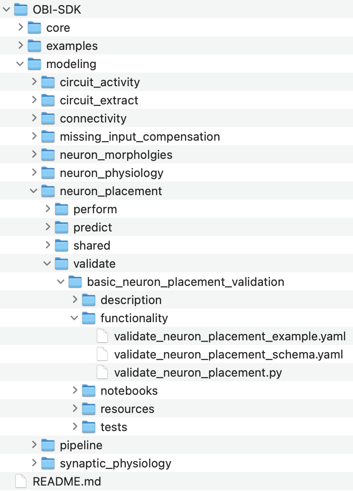
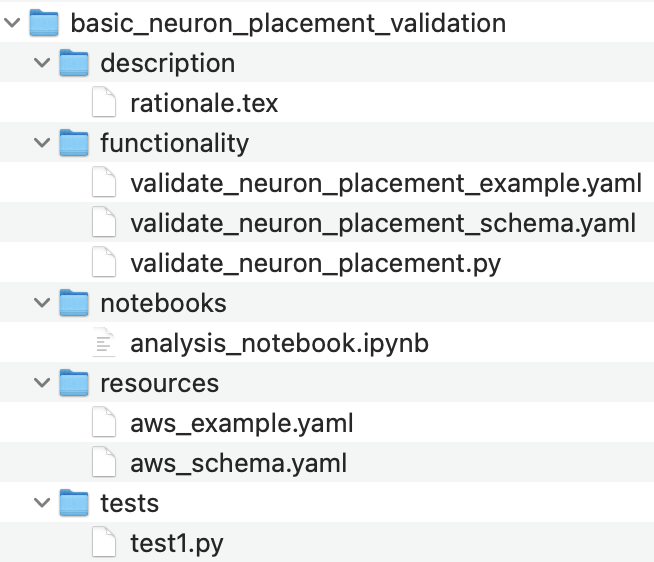
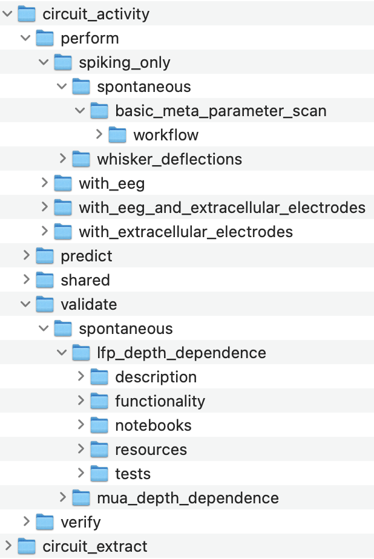
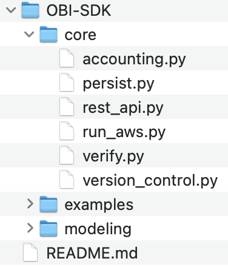
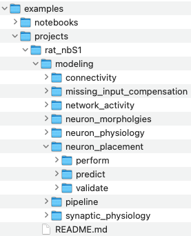
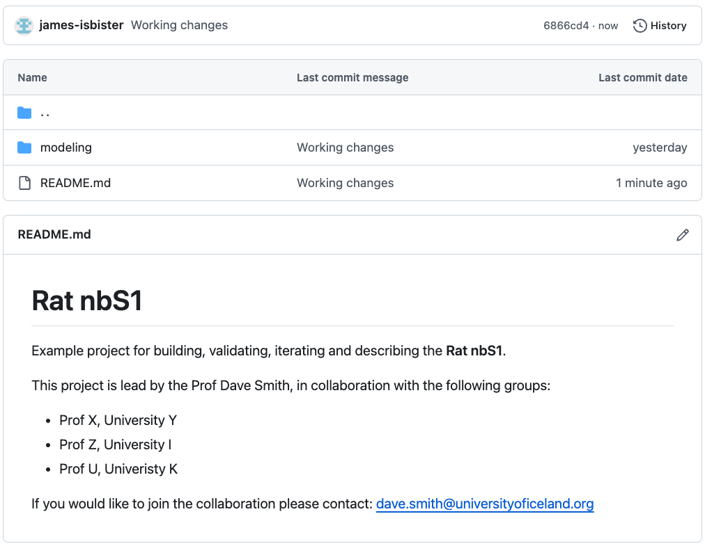
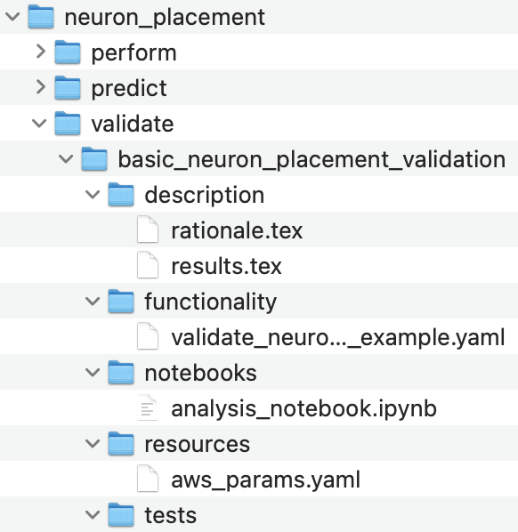
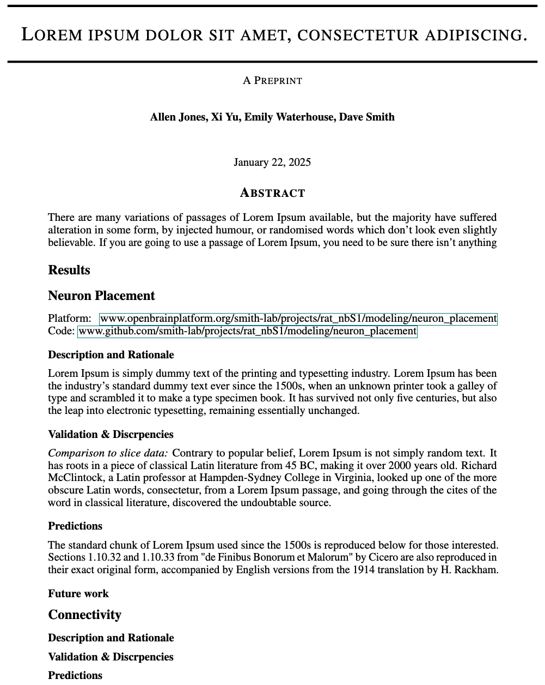
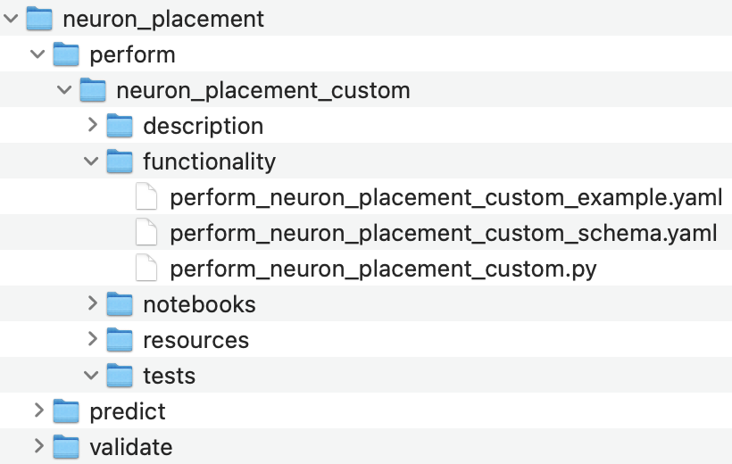
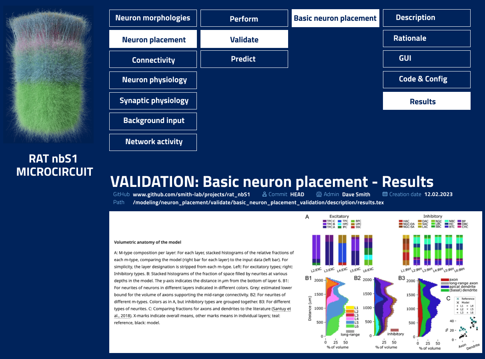

# OBI-SDK + Platform Integration - Scientific Proposal
- Here we define an initial **proposal** for a general organization of code and data, which can:
    - **Maximise the scientific utility of the Platform**
    - **Accelerate the field of Simulations Neuroscience**
- The aim is to provide a basis for discussions, iteration and the potential prototyping of a general data and code organization.
- The general idea is to have a single SDK for using BBP libraries with AWS, SQL persistance and version control of user code. The SDK can be used both directly by users and by the platform.

# 1. Library of Modeling Code
OBI-SDK organized by:
- A **LIBRARY of MODELING CODE organized HIERARCHICALLY** by:
    1. Modeling **STAGE** (i.e. neuron placement, network activity etc)
    2. Modeling **STEP** (i.e. perform, validate, predict). 

    Each modeling Step can have **multiple SUBSTEPS or alternative/complementary functions.**
    
    Each **Substep** is **defined** by a **single entry function** and **parameterization schema** (with an example parma config) in its own subdirectory:

    

    ---

- **Everything related to this SUBSTEP is then stored in the same location, including:**
    - **Tests**
    - **Descriptions/Rationale** (which can be rendered in the platform)
    - **Schemas for AWS/compute resources, and requirements**
    - **Notebooks.** Notebooks could also be generated automatically for library functions.

    

    ---

- **All modeling Stages and Steps including (for example) circuit building, extraction and simulation are organized in this way:**

    


    ---

- **Such standardization allows any step to be launched in the same way.**

    For example, passing **parameters** and **resources** config files to a Python script which then calls the rest API:
   ```bash
    run_aws.py \
    modeling/neuron_placement/validate/basic_neuron_placement_validation/functionality/validate_neuron_placement_example.yaml \
    modeling/neuron_placement/validate/basic_neuron_placement_validation/resources/aws_example.yaml
   ```
   Where the **parameters** config file specifies the **parameters, git branch/commit** and exact **function** to be run:
   ```yaml
   function: ./validate_neuron_placement.py
   branch: main
   commit: HEAD
   params: 
    output_data: ./neuron_placment/validate/basic_neuron_placement
    proportion_of_cells: 0.2
   ```
   And the **resources** config file specifies the AWS resources:
   ```yaml
   nodes: 1
   cores_per_node: 4
   persistance_root: openbluebrain.s3.us-west-2.amazonaws.com.....
   project: sscx_v2
   user: smith
   ```

    Calling **run_aws** might **commit and push** existing code (if required) and **call the rest API** (PUSH, passing the two configuration files). 
    
    The **service** then **launches the function** using the correct **commit for each step** and the **specified / appropriate resource.**

    ---

- **PIPELINES of Stages and Steps can then be defined in Pipeline config files** which point to different stage/step configuration files:
    ```yaml
    project: "SSCx_v2"
    aws_persistance_root: ""

    stages:
        neuron_placement: 
            perform: ...
            validate:
                basic_neuron_placement_validation:
                    root: "./modeling/neuron_placement/validate/basic_neuron_placement_validation/"
                    functionality: functionality/validate_neuron_placement_example.yaml
                    resources: resources/aws_example.yaml
            predict: ...

        connectivity:
            peform: ...
            validate: ...
            predict: ...
   ```

---

# 2. Core operations

**Single Core API for running code, calling rest AWS services, persisting/managing artifacts, accounting, managing version control.** 

Works with standardized content of **modeling library** (i.e. schemas, code, version control, etc.)

Possibly stored in the same SDK:




---


# 3. Example User Project (with GitHub + Paper generation)

- **Example/user projects use a similar structure to the modeling library**, with a seperation into Stages and Steps, and one or multiple pipelines.**

    


---

- **Each user project corresponds with a version controlled repository (i.e. GitHub):**

    

---


- **Configuration, latex and resource files are organized with a similar hierarchical structure to that of the modeling library:**

    

    Here **the Step configuration file can point to the SDK function**:
    ```yaml
    function: obi-sdk/modeling/neuron_placement/validate/basic_neuron_placement_validation/validate_neuron_placement.py
    branch: main
    commit: HEAD
    params: 
        output_data: ./neuron_placment/validate/basic_neuron_placement
        proportion_of_cells: 0.2
   ```

---

- **Maintaining DESCRIPTIONS within this hierarchical structure allows users to write the paper in the Platform/GitHub repo as they go.**

    The hierarchy confers a natural and optimal organization of the paper based on our experience of peer review, with corresponding code for each step.

    

---

- **Users can also add custom code within the project** and reference these functions rather than those in the SDK:

    

    The configuration file can then reference these custom function rather than functions in the SDK:
    ```yaml
    function: rat_nbs1/modeling/neuron_placement/validate/basic_neuron_placement_validation/perform_neuron_placement_custom.py
    branch: main
    commit: HEAD
    params: 
        output_data: ./neuron_placment/validate/basic_neuron_placement
        proportion_of_cells: 0.2
   ```

---

- **Custom code could also be added in forks of the SDK**, which could be pulled into the main branch later.

---

- **Input and output artifacts for each function all comply with our SQL schema.** It might be beneficial to store the schema in the same repository so that users can add functionality without having to sync two seperate repositories (syncing seperate repos may seem challenging / risky to low/medium skill git users):


---

- **By default, artifacts are stored with meta-data referencing the code, branch, commit, and position in the Stages and Steps hierarchy.**

---

# 4. Platform

Any **project** created through the platform has a direct correspondence with the proposed **GitHub** project structure, and vice versa. 

Under this organization, the Platform can offer:

- **An entry point for new users to generate projects and parameterize configuration files.** Through the GUI they can create projects and gradually build up pipelines of functions. The GUI offers both 1) simple form based parameterization of configuration files based on the schema of any OBI-SDK library function and 2) more advanced custom GUI elements for parameterizing configuration files (i.e. existing single cell).

- **Clear, general and hierarchical organization and navigation of complex multifaceted models. The hierachical organization of the underlying GitHub repository corresponds with easy navigation through the platform to code, rationale, description of methods and results for all validations, predictions and building steps.** This has huge benefits for the communication of models; both for potential users and peer reviewers. Currently both groups have to dive into many recent and historic publications, to understand the building steps, rational, validations and predictions made with our models.




- **Management/visualisation of data entities**

- **Clear correspondence between code and GUI elements.**

- **Automatic generation of project GitHub repository.**

---

# 5. Advantages

Such an organization has a number of additional advantages:

- **Generality to decouple the contents that scientists can manage and the technical side managed by the engineering team.** Such a framework can rapidly allow us to collate existing code into usable features.

- **High scientific flexibility.**

- **Reproducibility and impact enabled by cloud deployment.** Being able to publish a paper with code that anyone can easily run and recreate on the cloud would be very attractive to scientists; particularly because citations often come from the ability to extend/re-use work.

- **Standardize the organization of code, data and descriptions for use by LLMs.** The standardization of modelling Stages and Steps, with corresponding code and descriptions is well suited for LLMs.

- **In developing a framework, collate and organize the code and dependencies which will form the basis of a platform. This code can be run by users to generate income before even being accessible in the platform.**

- **A framework for collaboration combining cloud compute and (eventual) burst-out to institution supercomputers.** The development, improvement and use of our models is extremely expensive in terms of compute and human time. Moreover, it remains a highly experimental process: unexpected issues (both engineering and scientific) are very common, meaning that code (including building, optimization, simulation and analysis) must often be rerun many times to attain a relevant result. Many labs and experts around the world have access to compute and may not currently have funds for cloud compute. The peer review process is also highly demanding, with reviewers expecting models to hugely advance the state of the art. For now, the complexity of our models demands a much wider community of neuroscientists to engage in the development and advancent of models, and the development process to be more structured. A compartmental GitHub-based structuring with SQL/AWS persistence would allow simple management of model development and validation, with clear Stages and Steps, some of which could be assigned for burst-out compute across the world.

- **A general GitHub based standard for cloud deployment (and busrt-out to university supercomputers in future) of brain models and analyses, with inherited integration into the platform.** Such a standard could also be used for the models of other groups, with descriptions, rationale etc of different Stages and Steps automatically being rendered in the platform.

- **Simple framework for automated testing of expected behaviour.** As scientists, we can rerun building, optimizations, simulations etc and verify expected behaviour.

- **Potential/eventual generality for any neuroscience use case.** Such an organization of code, compute and persistance would provide a powerful framework for scienctists.

- **Encourages/enables code generality/reusability through clear location and hierarchical organization for general code.** Users should also see a path for converting there existing code to a general piece of code that others can re-use across models and different simulations. 

- **No repetition of writing between platform communication and paper**

- **Code/configuration files for launching on AWS with each piece of code.** Anyone browsing the code can easily launch it on AWS and start spending $.


- We all become experts on and work on a single SDK.
- Gives users a feeling that there is a single learnable codebase that will offer mastery
- A community can be built around this single SDK. Similar to Spikeinterface.
- Impress big Neuroscience players