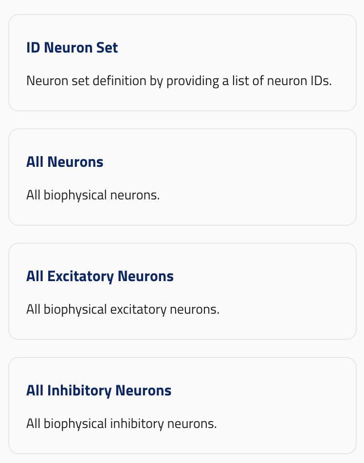

## block_dictionary

ui_element: `block_dictionary`

- They should contain no `properties`
- They should contain `additionalProperties` with a single `oneOf` array with block schemas.
- They should contain a `singular_name`.
- They should contain a `reference_types` array of strings, listing every `BlockReference` subclass that this dictionary **provides** — i.e. the reference types whose `block` resolves to an entry in this dictionary. A dictionary that provides only one reference type still uses a single-element list.

Reference schema: [block_dictionary](reference_schemas/block_dictionary.jsonc)

### Example Pydantic implementation

A dictionary that provides a single reference type:

```py
class Config:

    ## SimulationNeuronSetUnion is a union of blocks (i.e. classes with block_elements)

    neuron_sets: dict[str, SimulationNeuronSetUnion] = Field(
        default_factory=dict,
        title="Neuron sets",
        description="Neuron sets for the simulation.",
        json_schema_extra={
            SchemaKey.UI_ELEMENT: UIElement.BLOCK_DICTIONARY,
            SchemaKey.GROUP: "Group 1", # Must exit in parent config's `group_order` array
            SchemaKey.GROUP_ORDER: 0, # Unique within the group
            SchemaKey.SINGULAR_NAME: "Neuron Set",
            SchemaKey.REFERENCE_TYPES: [NeuronSetReference.__name__],
        }
    )

```

A dictionary that provides multiple reference types — one per block class in the union (see `CircuitSimulationScanConfig.neuron_sets` for an example using the pre-defined `ALL_NEURON_SETS_REFERENCE_TYPES` constant from `unions_neuron_sets_2.py`):

```py
class Config:

    neuron_sets: dict[str, AllNeuronSetUnion] = Field(
        default_factory=dict,
        title="Neuron Sets",
        description="Neuron sets for the simulation.",
        json_schema_extra={
            SchemaKey.UI_ELEMENT: UIElement.BLOCK_DICTIONARY,
            SchemaKey.GROUP: BlockGroup.CIRCUIT_COMPONENTS_BLOCK_GROUP,
            SchemaKey.GROUP_ORDER: 1,
            SchemaKey.SINGULAR_NAME: "Neuron Set",
            SchemaKey.REFERENCE_TYPES: [
                BiophysicalNeuronSetReference.__name__,
                VirtualNeuronSetReference.__name__,
                PointNeuronSetReference.__name__,
            ],
        }
    )

```

### UI design


