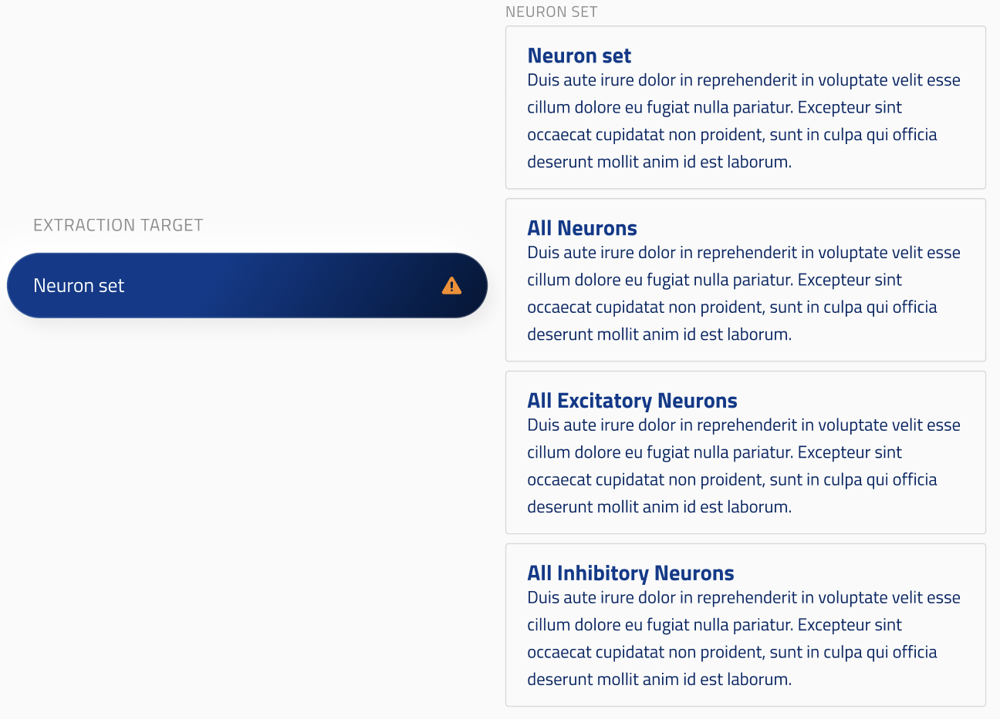

## block_union

ui_element: `block_union`

- They should contain a single `oneOf` array with block schemas.

Reference schema: [block_union](reference_schemas/block_union.jsonc)

### Example Pydantic implementation

```py
class Config:

    ## SimulationNeuronSetUnion is a union of blocks (i.e. classes with block_elements)

    neuron_set: SimulationNeuronSetUnion = Field(
        title="Neuron set",
        description="Neuron set for the simulation.",
        json_schema_extra={
            "ui_element": "block_union",
            "group": "Group 1", # Must be present in its parent's config `group_order` array,
            "group_order": 0, # Unique within the group.
        }   
    )

```

### UI design


