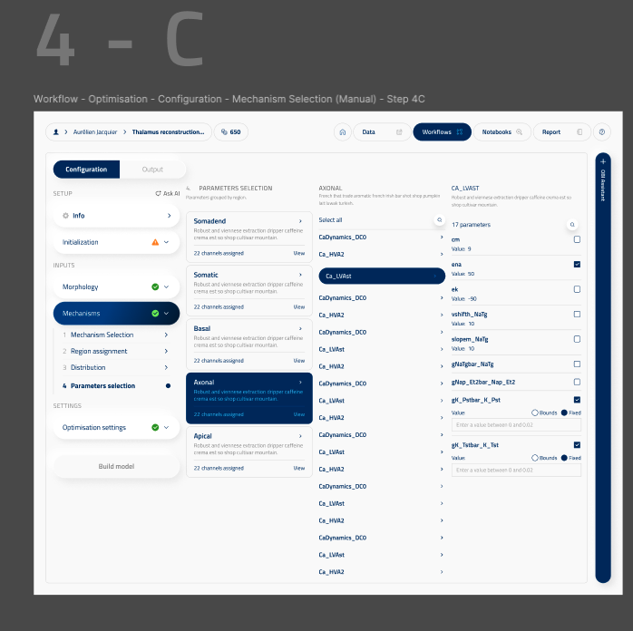

# EModel optimisation parameters

ui_element: `emodel_optimisation_parameters`

This is a distinct [Root UI element](../../gui-definition.md#types-of-ui-element), alongside `block_single`, `block_union`, and `block_dictionary`. It is the GUI contract for the Task 2 Mechanisms workflow and is not nested inside the legacy `parameters_selection` block.

Reference screenshot from Figma:



## Workflow

The Mechanisms workflow has four ordered steps:

1. **Mechanism Selection** — select `IonChannelModel` entities with the existing `model_identifier_multiple` UI.
2. **Region assignment** — assign selected models to `SectionListName` regions.
3. **Distribution** — configure the top-level `distance_dependent_distributions` sibling. It is displayed as step 3 but is not nested in the parameter object.
4. **Parameters selection** — edit global, distribution, base, and per-mechanism values with fixed/bounds and distribution controls.

The screenshot's section cards and per-channel parameter rows are projections of the same configuration. The backend remains responsible for variable normalization, validation, and compilation.

## Design and reference schema

- [Local form design reference](designs/emodel_optimisation_parameters.png)
- [Composed reference schema](reference_schemas/emodel_optimisation_parameters.jsonc)

The local PNG is the supplied Figma design reference for the implemented four-step layout and parameter-card structure. The reference schema describes this root element's own composed shape; its nested leaf fields reuse the existing `block_dictionary` and `model_identifier_multiple` UI contracts.

## Root schema

```text
EModelOptimizationScanConfig
├── emodel_optimisation_parameters: EModelOptimisationParameters
│   ├── mechanisms: MechanismsBySectionList
│   │   ├── ion_channel_models: tuple[IonChannelModelFromID, ...]
│   │   └── mechanism_regions: dict[SectionListName, tuple[MechanismRegionSelection, ...]]
│   ├── global_parameters
│   ├── base_parameters
│   └── distribution_parameters
└── distance_dependent_distributions: dict[str, CustomDistanceDependentDistribution]
```

`emodel_optimisation_parameters` is a root ScanConfig field using its own registered `ui_element` (`UIElement.EMODEL_OPTIMISATION_PARAMETERS` in `obi_one/core/schema.py`), following the same root-element contract (`title`, `description`, `group`, `group_order`) as `block_single`. Its nested fields use the existing block UI elements. `distance_dependent_distributions` remains a separate root field and is associated with the workflow using `step`/`step_order` metadata.

## Example

```json
{
  "emodel_optimisation_parameters": {
    "mechanisms": {
      "ion_channel_models": [
        {"id_str": "<ca-hva2-id>"},
        {"id_str": "<ca-lvast-id>"}
      ],
      "mechanism_regions": {
        "somatic": [
          {
            "ion_channel_model": {"id_str": "<ca-hva2-id>"},
            "parameters": {
              "gCa_HVAbar": {
                "value": {"mode": "bounds", "bounds": [0.0, 0.001]},
                "distribution": "uniform"
              }
            }
          }
        ]
      }
    },
    "global_parameters": {},
    "base_parameters": {},
    "distribution_parameters": {}
  },
  "distance_dependent_distributions": {}
}
```

One mechanism may be assigned to multiple regions. Entity IDs are deduplicated for staging, while each region assignment remains independent for compilation.

## Runtime mapping

```text
emodel_optimisation_parameters
        ↓
MechanismsBySectionList / EModelOptimisationParameters self-validation
        ↓
ParametersSelection (canonical compatibility view)
        ↓
EModelOptimizationScanConfig sibling validation
(section-list availability and distribution declarations)
        ↓
parameter_builder.build_params_definition()
        ↓
legacy BluePyEModel params.json
```

The compiler continues to consume `ParametersSelection`; the new root model changes the
configuration surface while validating its own mechanism and global/base references before
conversion. `EModelOptimizationScanConfig` then validates dependencies on sibling settings.
Legacy payloads using `parameters_selection` are accepted and normalized to the new root
field. New serialization emits only `emodel_optimisation_parameters`.

## Validation

- `ion_channel_models` must not contain duplicate EntityCore IDs.
- Region assignments and global parameter sources must reference selected models.
- A model may be assigned to more than one region.
- Section keys use the canonical `SectionListName` catalog.
- Section availability follows the selected axon modifier. With `axon_modifier: "none"`,
  `myelinated` rows are unavailable because staged SWC preflight cannot establish a populated
  runtime myelinated section list.
- RANGE/GLOBAL variable placement is validated by the existing parameter compiler.
- Fixed and bounds values use `OptimizationValue`.
- Parameter distributions must be declared by the external `distance_dependent_distributions`
  field or be a standard distribution.
- Existing mechanism staging, recipe generation, SONATA export, and legacy params output
  remain unchanged.
