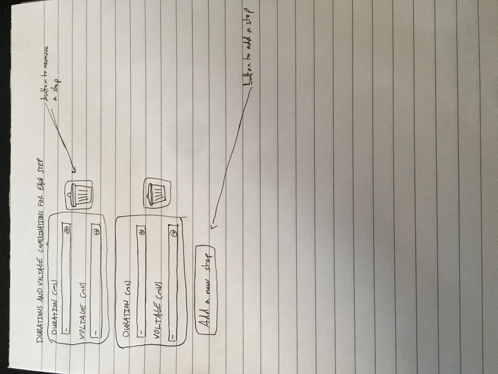

## Expandable list

ui_element: `expandable_list`

- Should have an subelement_ui_elements list of strings.
- The subelement_ui_elements allowed are int_parameter_sweep and float_parameter_sweep
- Should have an subelement_titles list of strings.
- Should have subelement_units list of strings.

Reference schema [expandable_list](reference_schemas/expandable_list.json)

### Example Pydantic implementation


```py

class Block:

    duration_voltage_combinations: list[tuple[NonNegativeFloat | list[NonNegativeFloat], float | list[float]]] = Field(
        title="Duration and voltage combinations for each step",
        description="A list of duration and voltage combinations for each step of the SEClamp stimulus. \
                    Each combination specifies the duration and voltage level of a step input. \
                    The duration is given in milliseconds (ms) and the voltage is given in millivolts (mV).",
        json_schema_extra={
            "ui_element": "expandable_list",
            "subelement_ui_elements": ["float_parameter_sweep", "float_parameter_sweep"],
            "subelement_titles": ["Duration", "Voltage"],
            "subelement_units": ["ms", "mV"],
        },
    )
    
```

### UI design

