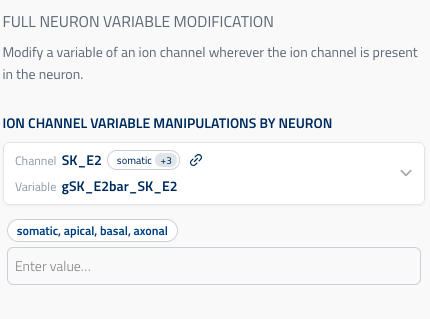

## Full neuron variable modification

UIElement: `UIElement.ION_CHANNEL_VARIABLE_MODIFICATION_BY_NEURON`

This component backs `ByNeuronMechanismVariableNeuronalManipulation`.

Use it to modify a mechanism variable everywhere in the selected neuron set:

- **GLOBAL variables** are written to `conditions.mechanisms`.
- **RANGE variables** are written to `conditions.modifications` with `configure_all_sections`.

Reference schema: [variable_modification_by_neuron](reference_schemas/variable_modification_by_neuron.json)

### UI design



User flow:

1. Pick a channel + variable from the dropdown.
2. Enter one numeric value.

The variable picker is populated from mapped circuit properties using:

- `SchemaKey.PROPERTY_GROUP = "Circuit"`
- `SchemaKey.PROPERTY = "MechanismVariablesByIonChannel"`

### Example Pydantic implementation

```py
class ByNeuronMechanismVariableNeuronalManipulation(Block):
    title: ClassVar[str] = "Full Neuron Variable Modification"

    neuron_set: NeuronSetReference | None = Field(
        default=None,
        title="Neuron Set (Target)",
        description="Neuron set to which modification is applied.",
        exclude=True,
        json_schema_extra={SchemaKey.UI_HIDDEN: True},
    )

    modification: ByNeuronModification = Field(
        title="Ion channel variable manipulations by neuron",
        description="Ion channel variable modification (RANGE or GLOBAL) by neuron.",
        json_schema_extra={
            SchemaKey.UI_ELEMENT: UIElement.ION_CHANNEL_VARIABLE_MODIFICATION_BY_NEURON,
            SchemaKey.PROPERTY_GROUP: MappedPropertiesGroup.CIRCUIT,
            SchemaKey.PROPERTY: CircuitMappedProperties.MECHANISM_VARIABLES_BY_ION_CHANNEL,
        },
    )
```

### Data model (`ByNeuronModification`)

- `ion_channel_id` (`uuid.UUID | None`): selected ion channel entity ID (if applicable).
- `channel_name` (`str | None`): channel suffix used as `conditions.mechanisms` key for GLOBAL changes.
- `variable_name` (`str`): variable name to modify.
- `variable_type` (`"RANGE" | "GLOBAL"`, default `"GLOBAL"`): update mode.
- `new_value` (`float | list[float]`): value to apply.

### SONATA output

For **RANGE** variables, this block emits one `conditions.modifications` entry:

```json
{
  "name": "modify_gSK_E2bar_SK_E2_all",
  "node_set": "single",
  "type": "configure_all_sections",
  "section_configure": "%s.gSK_E2bar_SK_E2 = 0.002"
}
```

For **GLOBAL** variables, this block emits a `conditions.mechanisms` fragment:

```json
{
  "SK_E2": {
    "vmin_SK_E2": -80.0
  }
}
```

See SONATA docs: <https://sonata-extension.readthedocs.io/en/latest/sonata_simulation.html#parameters-required-for-modifications>
