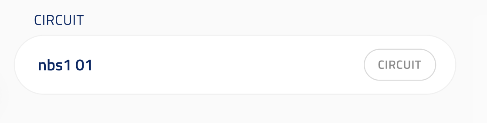

## Model identifier

ui_element: `model_identifier`

- Should accept as input an object including an `id_str` string field.

The accepted entity is encoded in the field's **type** (the discriminated union and its `type` const), so no `entity_query` is needed. For a single-entity selector that declares the accepted entity as data via `entity_query` instead (and supports server-side filtering), see [model_selector_single](../model_selector/model_selector.md).

Reference schema [model_identifier](reference_schemas/model_identifier.jsonc)

### Example Pydantic implementation

```py

class Circuit:
    pass

# Required
class CircuitFromId(OBIBaseModel):
    id_str: str = Field(description="ID of the entity in string format.")


class Block:
    circuit: Circuit | CircuitFromId = Field( # Other elements in the union other than `CircuitFromId` not required.
            title="Circuit", description="Circuit to simulate.",
            json_schema_extra={SchemaKey.UI_ELEMENT: UIElement.MODEL_IDENTIFIER} 
        )
```

### UI design

