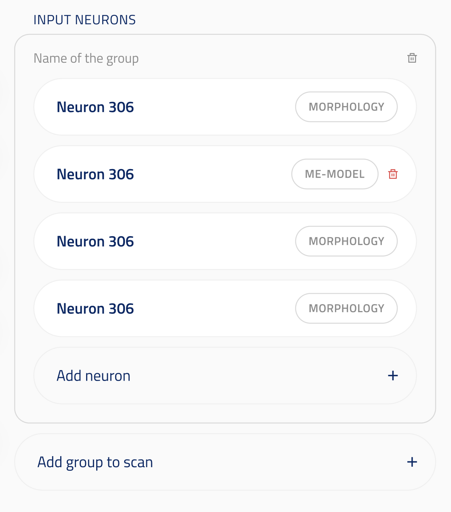
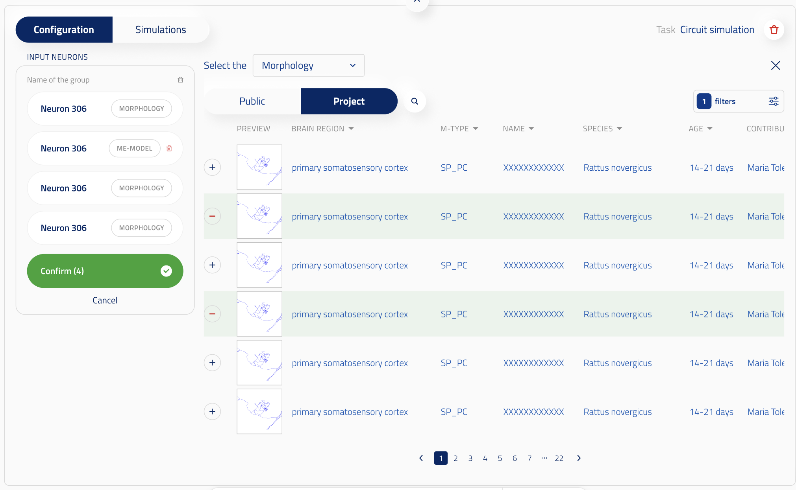

## Model identifier grouped UI element

ui_element: `UIElement.MODEL_IDENTIFIER_GROUPED`

Reference schema [MODEL_IDENTIFIER_GROUPED](reference_schemas/model_identifier_grouped.json)

This element covers case D of the multiple-entities spec: scanning over named sets of multiple entities. For a flat selection (cases B and C) refer to [model_identifier_multiple](../multiple_entities/multiple_entities.md).

The value is a NamedTuple , or a list of them, defined in `obi_one.scientific.from_id.named_tuple_from_id`. Each group carries a `name` and an `elements` array of entity identifiers. The single-group and list-of-groups branches reference the same group schema.

### UI design

In the form, the user selects multiple entities in a group by clicking `Add <entity type>`, and can add further groups with `Add group` (each group is one NamedTuple in the list). The user can remove entities and groups, as long as at least one entity remains.



When selecting more entities:



### Config example

```py
class EMSynapseMappingInputNamedTuple(NamedTupleBase):
    elements: tuple[CellMorphologyFromID | MEModelFromID, ...] = Field(min_length=1)


neurons: EMSynapseMappingInputNamedTuple | list[EMSynapseMappingInputNamedTuple] = Field(
    title="Neurons",
    description="Neurons to include in the circuit (>= 1).",
    json_schema_extra={
        SchemaKey.UI_ELEMENT: UIElement.MODEL_IDENTIFIER_GROUPED,
        SchemaKey.ACCEPTED_INPUT_TYPES: [
            AcceptedInputTypes.CELL_MORPHOLOGY_FROM_ID, AcceptedInputTypes.ME_MODEL_FROM_ID
        ],
    },
)
```
