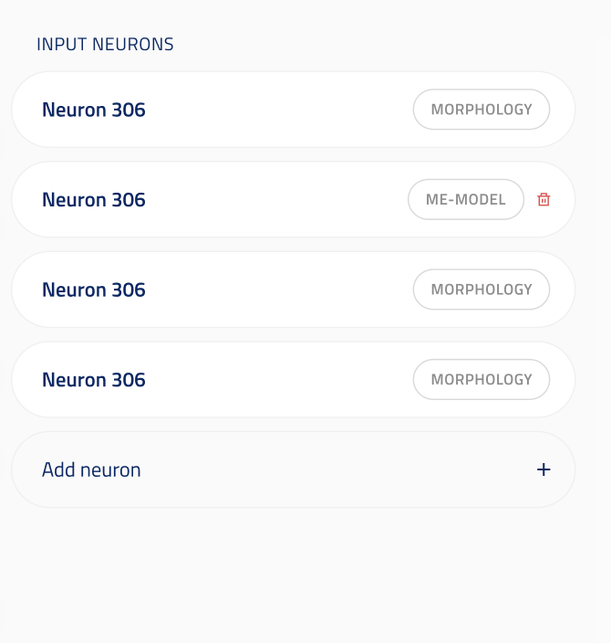
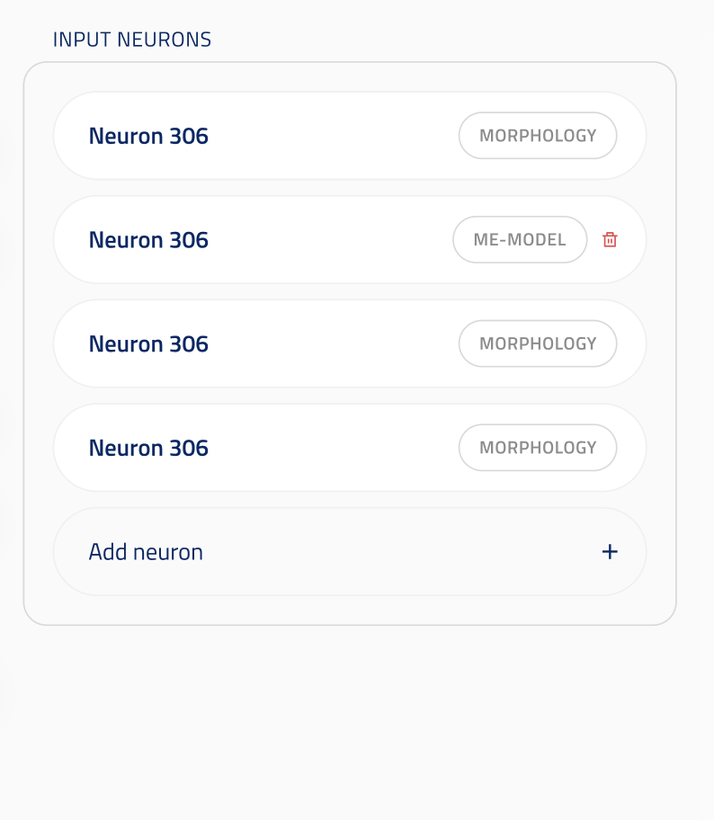
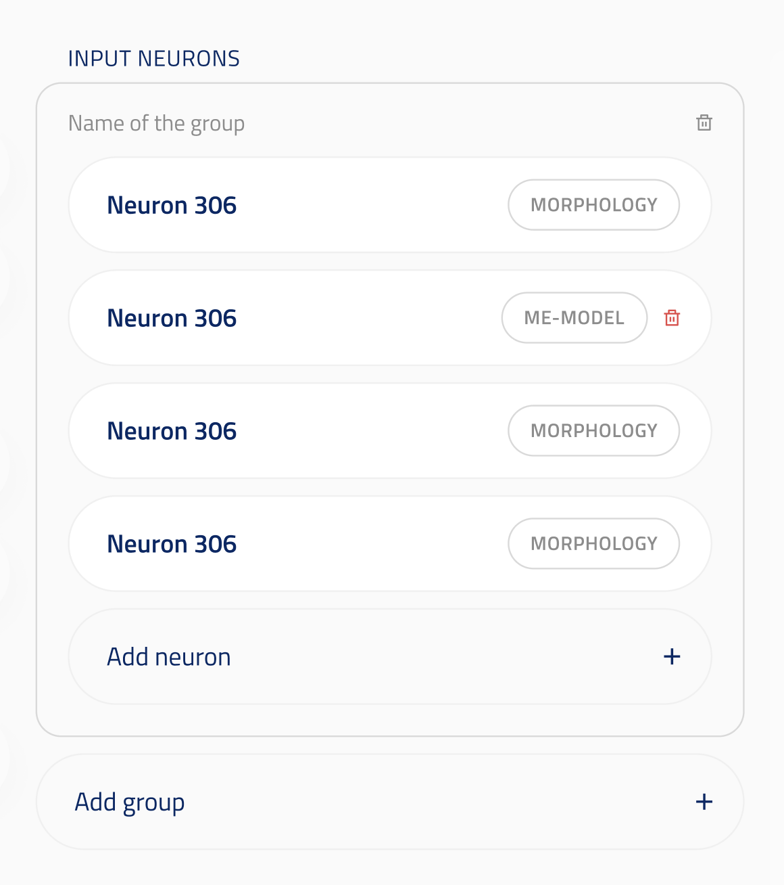
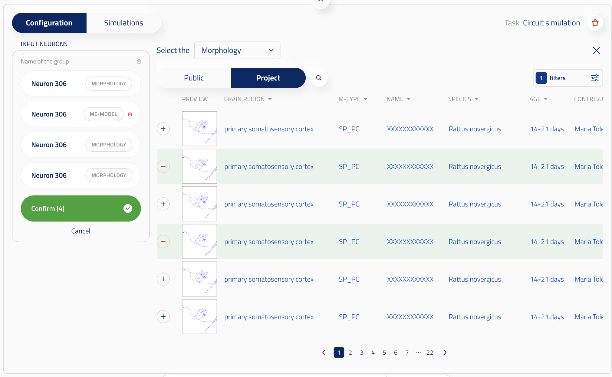

## Model identifier multiple UI element

ui_element: `UIElement.MODEL_IDENTIFIER_MULTIPLE`

Reference schema [MODEL_IDENTIFIER_MULTIPLE](reference_schemas/model_identifier_multiple.json)

We have 4 different cases:

A. Only one single model is used. For this use case, refer to [model_identifier](components/model_identifier/model_identifier.md).

B. Scan over single entities.

C. Multiple entities in a single task, without any scan.

D. Scan over sets of multiple entities.

This documentation covers cases B, C and D.

### UI design

#### In the form

case B:

case C:

case D:

In the form, user can select multiple entities in an entity group by clicking on the `Add <entity type>` button.

In case B, those entities are stored in a list. In case C, they are stored in a tuple. In case D, they are stored in a dict of tuples within a list. The different types are used so that it is easy to distinguish between the different cases.

In case D, user can add a new entity group by clicking on `Add group`. This adds a dict[tuples] to the list.

By default, when the user clicks on the workflow, they have to first select one or multiple entities.

In case D, when going on the form, they have the entities they have previously selected being in a single group. They can then select more entities or add groups.

User can also remove entities (and/or groups in case D), as long as they have at least one entity.

#### When selecting more entities

case B & C:

case D:

When the user clicks on `Add <entity type>`, the left-side of the UI collpases and the selection UI appears in the middle and right-side of the UI. There are the usual Public/Project buttons, Species/Brain region selection and Filters. In case different entity types are accepted, (e.g. morphology and me-model for EM synpase mapping UI), then another dropdown appears, allowing the user to select the entity type.

+ buttons next to the entities that are not yet in the group let user add the entity to the group. - button next to the entities that are already in the group let the user remove an entity from the group.
