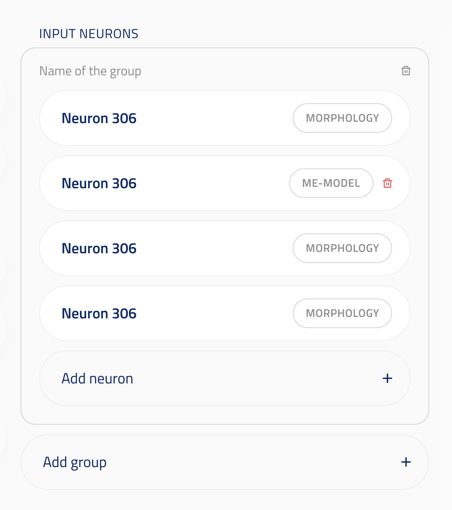
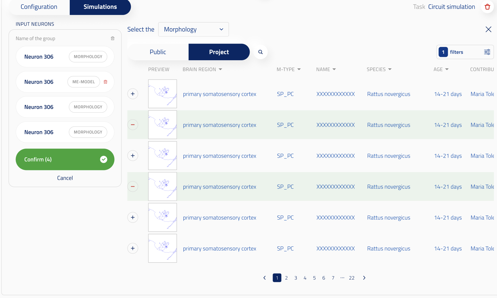

## Model identifier multiple UI element

ui_element: `UIElement.MODEL_IDENTIFIER_MULTIPLE`

Reference schema [MODEL_IDENTIFIER_MULTIPLE](reference_schemas/model_identifier_multiple.json)

### UI design

#### In initialization block

In initialization block, user can select multiple entities in an entity group by clicking on the `Add <entity type>` button. Those entities are stored in a tuple.

User can also scan over groups of entities. They can add a new entity group by clicking on `Add group`. The groups are stored within a list.

By default, when the user clicks on the workflow, they have to first select an entity. When going on initilization, they have this entity being in a group. They can then selects more entities or add groups. 

User can also remove groups or entities within a group, as long as they have at least one group with one entity in it.

#### When selecting more entities

When the user clicks on `Add <entity type>`, the left-side of the UI collpases and the selection UI appears in the middle and right-side of the UI. There are the usual Public/Project buttons, Species/Brain region selection and Filters. In case multiple entity types are accepted, (e.g. morphology and me-model for EM synpase mapping UI), then another dropdown appears, allowing the user to select the entity type.

+ buttons next to the entities that are not yet in the group let user add the entity to the group. - button next to the entities that are already in the group let the user remove an entity from the group.
