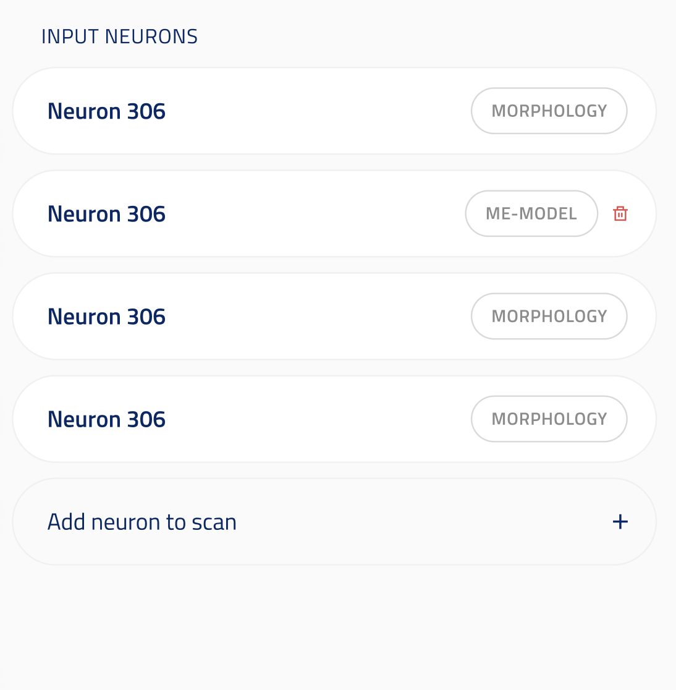
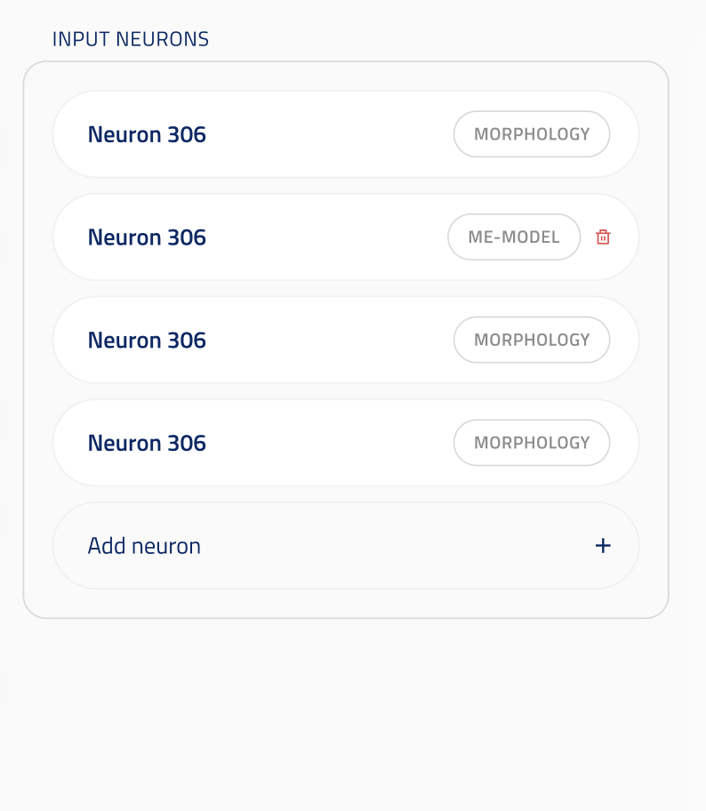

## Model identifier multiple UI element

ui_element: `UIElement.MODEL_IDENTIFIER_MULTIPLE`

Reference schema [MODEL_IDENTIFIER_MULTIPLE](reference_schemas/model_identifier_multiple.json)

This element covers a flat selection of entities. There are 3 related cases:

A. Only one single model is used. For this use case, refer to [model_identifier](../model_identifier/model_identifier.md).

B. Scan over single entities.

C. Multiple entities in a single task, without any scan.

This documentation covers cases B and C. For scanning over named sets of multiple entities (case D), refer to [model_identifier_grouped](../model_identifier_grouped/model_identifier_grouped.md).


### UI design

#### In the form

case B:



case C:



In the form, user can select multiple entities by clicking on the `Add <entity type>` button.

In case B, those entities are stored in a list. In case C, they are stored in a tuple. The different types are used so that it is easy to distinguish between the cases.

By default, when the user clicks on the workflow, they have to first select one or multiple entities.

User can also remove entities, as long as they have at least one entity.

#### When selecting more entities


When the user clicks on `Add <entity type>`, the left-side of the UI collpases and the selection UI appears in the middle and right-side of the UI. There are the usual Public/Project buttons, Species/Brain region selection and Filters. In case different entity types are accepted, then another dropdown appears, allowing the user to select the entity type.

+ buttons next to the entities that are not yet selected let user add the entity. - button next to the entities that are already selected let the user remove an entity.


### Limiting the number of selections

The field's own type bounds the selection: `min_length` / `max_length` on the Pydantic field become `minItems` / `maxItems` in the schema, and the frontend prevents selecting more than `maxItems` entities.


### Config examples

## case B:

```py
cell_mesh: EMCellMeshFromID | list[EMCellMeshFromID] = Field(
    title="EM Cell Mesh",
    description="EM cell mesh to use for skeletonization.",
    json_schema_extra={SchemaKey.UI_ELEMENT: UIElement.MODEL_IDENTIFIER_MULTIPLE},
)
```

## case C

```py
electrical_cell_recording: tuple[ElectricalCellRecordingFromID, ...] = Field(
    title="Electrical cell recordings",
    description="ElectricalCellRecording entities to extract features from (>= 1).",
    min_length=1,
    max_length=3,  # optional cap: emits maxItems, honored by the frontend
    json_schema_extra={
        SchemaKey.UI_ELEMENT: UIElement.MODEL_IDENTIFIER_MULTIPLE,
    },
)
```
