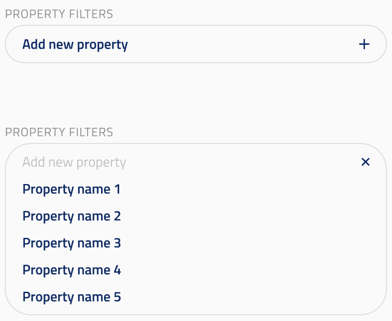
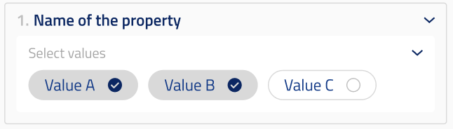
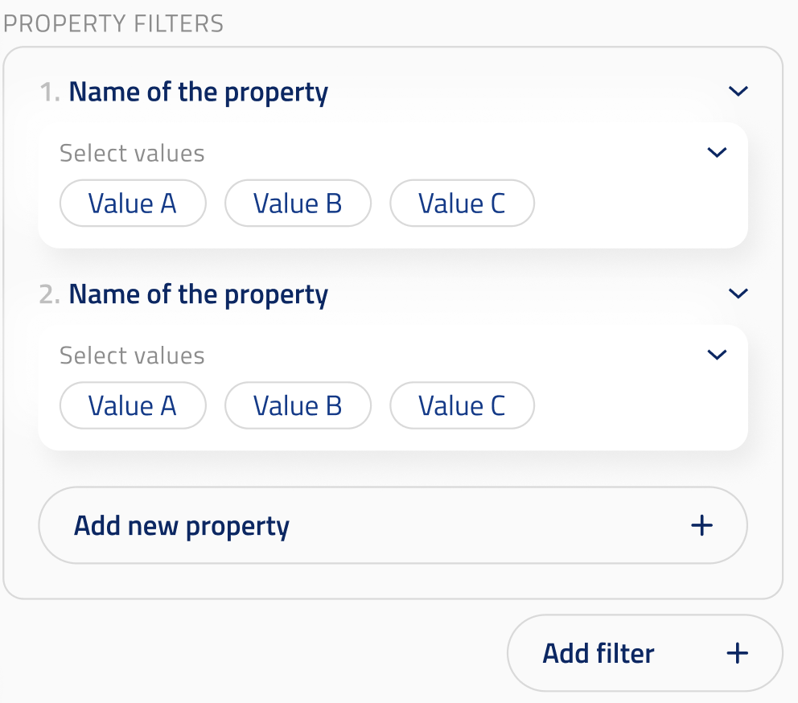

## Neuron property filter

ui_element: `neuron_property_filter`

This component backs the `property_filter` field of `PropertyNeuronSet` (see
`obi_one/scientific/blocks/neuron_sets_2/property.py`). It lets the user build
one or more filters over node properties of the population selected on the
parent block.

`PropertyNeuronSet` is a subclass of `PopulationNeuronSet`, which exposes a
user-selectable `population` field rendered as an
[entity_property_dropdown](../entity_property_dropdown/entity_property_dropdown.md).
The set of properties and the set of accepted values for each property are
both scoped to that selected population — the UI must re-read its options
whenever `population` changes.

Reference schema:
[neuron_property_filter](reference_schemas/neuron_property_filter.json)

### Field properties

- Should accept either a single `NeuronPropertyFilter` object or a `list` of
  `NeuronPropertyFilter` objects (the list form is a multi-dimensional
  parameter sweep across filters, the same convention used elsewhere in
  obi-one).
- Should have the following non-validating properties:
    - `property_group` (str): the key of the `property_endpoints` dictionary
      on the parent scan config that resolves to the
      `mapped-circuit-properties` endpoint. The expected value is `"Circuit"`.
    - `property` (str): the key inside the property dictionary returned by that
      endpoint to read from. The expected value is
      `"NodePropertyUniqueValuesByPopulation"`.

The property dictionary at `property` is a two-level mapping:

```jsonc
// GET /declared/mapped-circuit-properties/{circuit_id}
{
  "NodePropertyUniqueValuesByPopulation": {
    "<population_name>": {
      "<property_name>": ["<value_1>", "<value_2>", ...],
      ...
    },
    ...
  },
  ...
}
```

The UI reads from this mapping using the population selected on the parent
block:

- The list of property names available for "Add new property" is
  `keys(NodePropertyUniqueValuesByPopulation[<selected_population>])`.
- Once the user picks a property, the list of selectable values is
  `NodePropertyUniqueValuesByPopulation[<selected_population>][<selected_property>]`.

When the user changes the population on the parent block, any properties or
values on the existing filter that are not present for the new population
should be cleared.

### `NeuronPropertyFilter` data model

A single `NeuronPropertyFilter` is one row in the UI panel. Its data model is:

- `filter_dict` (`dict[str, list]`): mapping from property name to a non-empty
  list of accepted values. The list inside a `NeuronPropertyFilter` is **not**
  a multi-value parameter sweep — it is the set of values that match this
  property (e.g. `{"layer": ["2", "3"]}` means "layer is 2 or 3"). Sweeps
  over filters are expressed at the outer level by providing
  `list[NeuronPropertyFilter]`.

### Example Pydantic implementation

```py
class NeuronPropertyFilter(OBIBaseModel):
    filter_dict: dict[str, list] = Field(
        title="Filter",
        description="Filter dictionary. The list per key is NOT a multi-dimensional "
                    "parameter sweep but the set of accepted values for the property, "
                    "e.g. {'layer': ['2', '3']}.",
    )


class PropertyNeuronSet(PopulationNeuronSet):

    property_filter: NeuronPropertyFilter | list[NeuronPropertyFilter] = Field(
        title="Neuron property filter",
        description="NeuronPropertyFilter object or list of NeuronPropertyFilter objects",
        json_schema_extra={
            SchemaKey.UI_ELEMENT: UIElement.NEURON_PROPERTY_FILTER,
            SchemaKey.PROPERTY_GROUP: MappedPropertiesGroup.CIRCUIT,
            SchemaKey.PROPERTY: CircuitMappedProperties.NODE_PROPERTY_UNIQUE_VALUES_BY_POPULATION,
        },
    )
```

### UI design

A newly created `PropertyNeuronSet` starts with no filter rows: the panel only
shows the "Add new property" affordance. Clicking it opens a dropdown listing
the property names available for the currently selected population.



Once a property is picked, the row expands into a property picker plus a
multi-value selector for that property's values.



After the first property is picked, the panel shows the populated row(s),
exposes "Add new property" inside the filter (to add another property to
the same `NeuronPropertyFilter`), and "Add filter" outside the filter (to
append another `NeuronPropertyFilter` to the `list[NeuronPropertyFilter]`
sweep).



User flow:

1. The parent `PopulationNeuronSet` has a population selected via its
   `entity_property_dropdown`.
2. The user clicks "Add new property" and picks a property from the list of
   property names returned for that population under
   `NodePropertyUniqueValuesByPopulation[<population>]`.
3. The UI shows the unique values for that property (the list at
   `NodePropertyUniqueValuesByPopulation[<population>][<property>]`) and the
   user toggles the values to include.
4. Repeat for additional properties on the same filter (combined as AND).
5. To express a parameter sweep over filters, add another filter — this maps
   to an additional element of `list[NeuronPropertyFilter]`.
