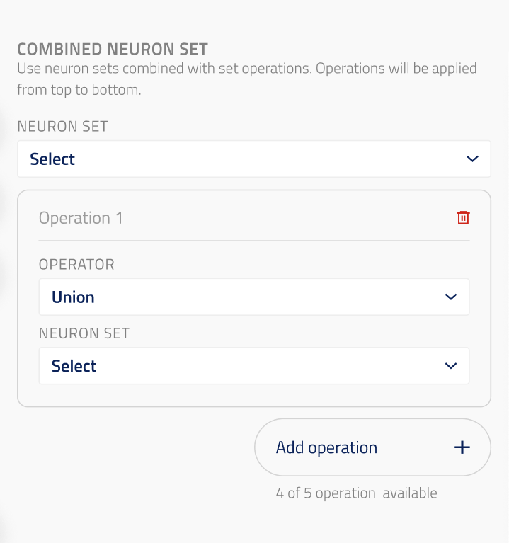

## Neuron set combination

ui_element: `neuron_set_combination`

This component backs the `combined_with` field of `CombinedBaseNeuronSet`
subclasses (see `obi_one/scientific/blocks/neuron_sets/combined.py`). It lets
the user build a list of (neuron set reference, set operation) pairs that are
sequentially applied to a base neuron set.

Reference schema:
[neuron_set_combination](reference_schemas/neuron_set_combination.json)

### Field properties

- Should accept as input an `array` of objects, where each object contains:
    - A neuron set **reference** (object with `block_name` and `block_dict_name`
      string fields).
    - A **set operation** string, one of `"union"`, `"intersect"`, or `"diff"`.
- The array may be empty (no combinations applied).
- Should have the following non-validating properties in `json_schema_extra`:
    - `reference_types` (list of str): the class names of `BlockReference`
      subclasses that are accepted as neuron set references in each entry.

### Data model

Each entry in `combined_with` is a 2-tuple (serialized as a fixed-length
array with exactly 2 items):

| Index | Type | Description |
|-------|------|-------------|
| 0 | reference object | The neuron set to combine with |
| 1 | `"union"` \| `"intersect"` \| `"diff"` | The set operation to apply |

The operations are applied sequentially in list order against the running
result, starting from `base_neuron_set`:

```
result = base_neuron_set
for (neuron_set, operation) in combined_with:
    result = operation(result, neuron_set)
```

### Example Pydantic implementation

```py
from obi_one.core.schema import SchemaKey, UIElement
from obi_one.scientific.blocks.neuron_sets.combined import SetOperation

class BiophysicalCombinedNeuronSet(CombinedBaseNeuronSet):

    combined_with: tuple[
        tuple[
            BlockReference,
            Literal[SetOperation.UNION, SetOperation.INTERSECT, SetOperation.DIFF],
        ],
        ...,
    ] = Field(
        default=(),
        title="Combine With",
        description="List of neuron sets and set operations to combine with the base neuron set.",
        json_schema_extra={
            SchemaKey.UI_ELEMENT: UIElement.NEURON_SET_COMBINATION,
            SchemaKey.REFERENCE_TYPES: [BiophysicalNeuronSetReference.__name__],
        },
    )
```

### UI design



The user starts with an empty combination list. Each row contains:

1. A **set operation selector** (dropdown: Union / Intersect / Difference).
2. A **neuron set reference picker** (same behavior as the `reference`
   component, scoped to the allowed reference types).

The user can:
- **Add** a new combination row (appends to the list), up to a maximum of 5 rows.
- **Remove** any existing row.

The list must have at least one entry for the combined neuron set to be valid.
