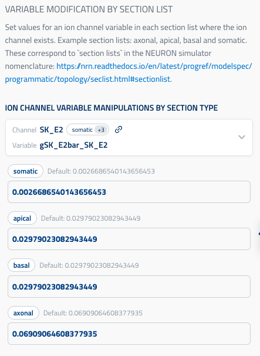

## Variable modification by section list

ui_element: `ion_channel_variable_modification_by_section_list`

This component backs `BySectionListMechanismVariableNeuronalManipulation`.

Use it to set a RANGE variable per section list (for example: `somatic`, `apical`,
`basal`, `axonal`). It supports both ion-channel RANGE variables and section
properties such as `cm` and `Ra`.

Reference schema:
[variable_modification_by_section_list](reference_schemas/variable_modification_by_section_list.json)

### UI design



User flow:

1. Pick a channel + variable from the dropdown.
2. Enter one value per section list shown by the UI.

The variable picker is populated from mapped circuit properties using:

- `property_group = "Circuit"`
- `property = "MechanismVariablesByIonChannel"`

### Example Pydantic implementation

```py
class BySectionListMechanismVariableNeuronalManipulation(Block):
    title: ClassVar[str] = "Variable Modification by Section List"

    neuron_set: NeuronSetReference | None = Field(
        default=None,
        title="Neuron Set (Target)",
        description="Neuron set to which modification is applied.",
        exclude=True,
        json_schema_extra={SchemaKey.UI_HIDDEN: True},
    )

    modification: BySectionListModification = Field(
        title="Ion channel variable manipulations by section type",
        description="Ion channel RANGE variable modification by section list.",
        json_schema_extra={
            SchemaKey.UI_ELEMENT: UIElement.ION_CHANNEL_VARIABLE_MODIFICATION_BY_SECTION_LIST,
            SchemaKey.PROPERTY_GROUP: MappedPropertiesGroup.CIRCUIT,
            SchemaKey.PROPERTY: CircuitMappedProperties.MECHANISM_VARIABLES_BY_ION_CHANNEL,
        },
    )
```

### Data model (`BySectionListModification`)

- `ion_channel_id` (`uuid.UUID | None`): selected ion channel entity ID (if applicable).
- `variable_name` (`str`): RANGE variable name to modify.
- `section_list_modifications` (`dict[str, float | list[float]]`):
  mapping of section list to value.

### SONATA output

This block emits one or more `conditions.modifications` entries:

- For `all`, it uses `configure_all_sections`.
- For specific section lists, it uses `section_list` entries.

Example output:

```json
[
  {
    "name": "modify_gSK_E2bar_SK_E2_somatic",
    "node_set": "single",
    "type": "section_list",
    "section_configure": "somatic.gSK_E2bar_SK_E2 = 0.002"
  },
  {
    "name": "modify_gSK_E2bar_SK_E2_apical",
    "node_set": "single",
    "type": "section_list",
    "section_configure": "apical.gSK_E2bar_SK_E2 = 0.03"
  },
  {
    "name": "modify_gSK_E2bar_SK_E2_all",
    "node_set": "single",
    "type": "configure_all_sections",
    "section_configure": "%s.gSK_E2bar_SK_E2 = 0.01"
  }
]
```

Section-list aliases are expanded by backend logic (`alldend`, `somadend`,
`allnoaxon`, `somaxon`, `allact`, `all`).

See SONATA docs: <https://sonata-extension.readthedocs.io/en/latest/sonata_simulation.html#parameters-required-for-modifications>
