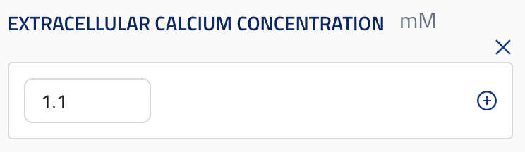

## Float parameter sweep

ui_element: `float_parameter_sweep`

- Should have an `anyOf` property.
- Should accept a `number` and `number array`.
- _The single `number` value must come first_.
- Optional `minimum` and `maximum` and `default` in both cases.
- Optional `units` string.

Reference schema [float_parameter_sweep](reference_schemas/float_parameter_sweep.jsonc)

### Example Pydantic implementation

```py

class Block:

    extracellular_calcium_concentration:  NonNegativeFloat | list[NonNegativeFloat] = Field( # The single value must come first in the union
            default=1.1,
            title="Extracellular Calcium Concentration",
            description=(
                "Extracellular calcium concentration",
            ),
            json_schema_extra={
                ui_element=UIElement.FLOAT_PARAMETER_SWEEP,
                units="mM",
            }
            
        )

```

### UI design



## Integer parameter sweep

ui_element: `int_parameter_sweep`

- Same as `parameter_sweep` but with `int` types in the `anyOf` array.

Reference schema [int_parameter_sweep](reference_schemas/int_parameter_sweep.jsonc)

### Example Pydantic implementation

```py
class Block:
    random_seed: int | list[int] = Field(
            default=1,
            title="Random seed"
            description="Random seed for the simulation.",
            json_schema_extra={SchemaKey.UI_ELEMENT: UIElement.INT_PARAMETER_SWEEP})
        )

```

## Float optional

ui_element: `float_optional`

- Should have an `anyOf` property.
- Should accept a `number` and `null` (a nullable float — **not** swept).
- _The single `number` value must come first, `null` second._
- `null` means the value is unset — e.g. "inherit from the level above".
- Optional `minimum` and `maximum` on the `number` and an optional `units` string.

Reference schema [float_optional](reference_schemas/float_optional.jsonc)

### Example Pydantic implementation

```py
class Block:
    spike_detection_threshold: float | None = Field(  # single value first, then None
            default=None,
            title="Spike detection threshold",
            description="eFEL Threshold. Leave unset to inherit from the level above.",
            json_schema_extra={
                SchemaKey.UI_ELEMENT: UIElement.FLOAT_OPTIONAL,
                SchemaKey.UNITS: Units.MILLIVOLTS,
            })
```