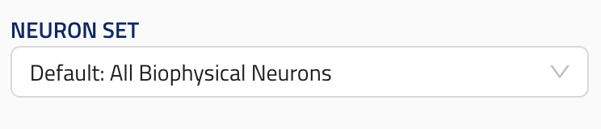

## Reference

ui_element: `reference`

[reference/reference.md](reference/reference.md).

- Should accept as input an `object` with `string` fields `block_name` and `block_dict_name`.
- Second element should be `null`.
- Should have a non-validating `reference_types` array of strings, listing every reference type the field accepts. Each entry is the class name of a `BlockReference` subclass and must match the type of one of the references allowed by the field's union.
- May have a non-validating `reference_tag` string naming the *role* the field plays, e.g. `stimulus_target`. The role is what the configuration keys its defaults by.

### The default option

Every reference offers a default option, labelled with the block the backend resolves the field to when it is left unset. That label is looked up in two places, in order:

1. the configuration's `reference_tag_defaults`, keyed by this field's `reference_tag`;
2. the configuration's `default_block_reference_labels`, keyed by reference type — the first entry in `reference_types` that has one.

The role wins because a reference *type* can be shared by fields that mean different things, and only the role tells them apart. In a Brian2 simulation an untargeted stimulus drives the `sugar` node set while the simulation itself runs every point neuron; both fields are `PointNeuronSetReference`, so keyed by type the configuration can only carry one of those answers.

Either source is sufficient on its own. A configuration that names all of its defaults by role need not publish `default_block_reference_labels` at all.

_References are hidden from the UI if either the `ui_hidden` property is `True` or neither source names a default for the field._ A visible reference with no default has no label for its default option, so the schema tests reject that rather than let the field disappear silently — hide one deliberately with `ui_hidden`.

Reference schema [reference](reference_schemas/reference.json)

### Example Pydantic implementation

A field that accepts a single reference type still uses a list with one element:

```py
class Block:
    node_set: NeuronSetReference | None = Field(default=None, # Must be present
                                                title="Neuron Set",
                                                description="Neuron set to simulate.",
                                                json_schema_extra={SchemaKey.UI_ELEMENT: UIElement.REFERENCE,
                                                                    SchemaKey.REFERENCE_TYPES: [NeuronSetReference.__name__]}
                                                )
```

A field that accepts a union of reference types lists each one:

```py
class Recording:
    neuron_set: BiophysicalNeuronSetReference | PointNeuronSetReference | TimestampsReference | None = Field(
        default=None,
        title="Neuron Set",
        description="Neuron set to record from.",
        json_schema_extra={
            SchemaKey.UI_ELEMENT: UIElement.REFERENCE,
            SchemaKey.REFERENCE_TYPES: [
                BiophysicalNeuronSetReference.__name__,
                PointNeuronSetReference.__name__,
                TimestampsReference.__name__,
            ],
        },
    )
```

A pre-defined module-level list constant can also be passed directly (e.g. `NON_VIRTUAL_NEURON_SETS_REFERENCE_TYPES` in `unions_and_references/combined_neuron_sets.py`).

### UI design


