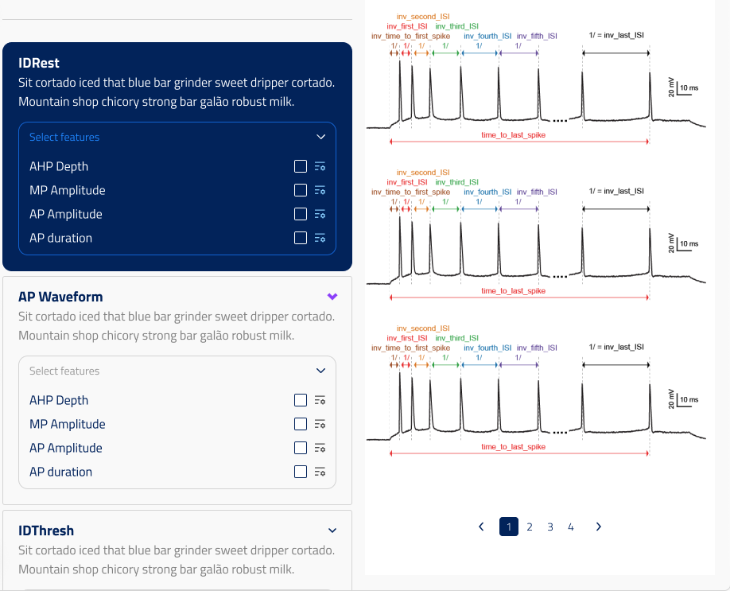

## select_efeatures_by_protocol

ui_element: `select_efeatures_by_protocol`

Backs [`SelectEFeaturesByProtocol`](../../../../obi_one/scientific/tasks/emodel_building/task1_efeature_extraction/blocks/protocol_and_feature_selection.py) — a single object that lets the user choose, per ephys protocol, which eFEL features to extract and at which stimulus amplitudes, with editable per-protocol and per-feature eFEL settings.

The object's `protocols` field is a tuple of concrete protocol classes. Each protocol carries:

- `features`: a discriminated union of exactly the eFEL features that protocol can
  extract, so the schema itself states the valid features per protocol (there is no
  separate catalogue extra).
- `extraction_amplitudes`: `(amplitude, is_validation)` pairs — the step amplitudes (nA)
  to extract, populated from the `AmplitudesByProtocol` property of the
  [`/declared/mapped-electrical-cell-recording-properties`](../../../../app/endpoints/electrical_cell_recording_properties.py)
  endpoint. The boolean flags an amplitude as validation-only.
- per-protocol eFEL overrides (`spike_detection_threshold`, `trace_resampling_timestep`)
  and stimulus timing (`stim_start`/`stim_end`/…).

Each feature in turn carries its own eFEL overrides (`spike_detection_threshold`,
`trace_resampling_timestep`, `stim_start`/`stim_end`). Unset (`null`) values inherit,
with precedence **feature > protocol > global**.

- The block field's `type` must be `"object"` — the field is a `$ref` to the object
  holding the selection, with the extras (`ui_element`, `property_endpoints`) as
  siblings of the `$ref`.
- The valid efeatures per protocol are read from each protocol's `features` union in
  the schema; there is no separate catalogue extra.
- The eFEL documentation base URLs used to deep-link a feature's docs/figures
  (`efel_doc_base_url`, `efel_figures_base_url`) live on the **config root**
  (`json_schema_extra_additions`), not on this field.
- The protocol and feature classes ship baked-in for the L5PC-style BluePyEModel
  protocols (`IDrest`, `IDthresh`, `IV`, `APWaveform`, `sAHP`, …).

### Endpoint data

The widget and its per-protocol amplitudes are both fed by
`GET /declared/mapped-electrical-cell-recording-properties?recording_ids=…`, which
returns a dictionary keyed by `ElectricalCellRecordingMappedProperties`:

| key | value |
|---|---|
| `Protocols` | sorted union of the matching `Protocol` **class names** across the recordings (e.g. `"IDRestProtocol"`), matching each protocol's `type` discriminator |
| `ProtocolsByRecording` | `{recording_id: [protocol class name, …]}` |
| `AmplitudesByProtocol` | `{protocol class name: [step amplitude (nA), …]}`, discovered from the recordings' NWBs |

That one endpoint is wired into the config in two places, one per property:

- **Protocols** — this `select_efeatures_by_protocol` field declares
  `property_endpoints: "declared/mapped-electrical-cell-recording-properties"`. The
  frontend reads `Protocols` / `ProtocolsByRecording` to decide which protocol boxes
  to render, mapping the class names onto the entries of the `protocols` tuple (by
  their `type` discriminator).
- **Amplitudes** — each protocol's `extraction_amplitudes` field declares
  `property_group: "Inputs"`, `property: "AmplitudesByProtocol"`, and the config's
  top-level `property_endpoints` maps the `"Inputs"` group to the same endpoint. The
  frontend reads `AmplitudesByProtocol[<protocol class name>]` to offer that
  protocol's discovered step amplitudes (each paired with an `is_validation` flag).

### Example Pydantic implementation

```py
class ProtocolAndFeatureSelection(Block):
    selection: SelectEFeaturesByProtocol = Field(
        default_factory=SelectEFeaturesByProtocol,
        title="EFeatures by protocol",
        description="...",
        json_schema_extra={
            SchemaKey.UI_ELEMENT: UIElement.SELECT_EFEATURES_BY_PROTOCOL,
            SchemaKey.PROPERTY_ENDPOINTS: "declared/mapped-electrical-cell-recording-properties",
        },
    )
```

### User flow

1. Frontend calls `/declared/mapped-electrical-cell-recording-properties` with the
   selected `ElectricalCellRecording` ids; reads `Protocols` (the union of protocol
   **class names**, matching each protocol's `type` discriminator) and
   `AmplitudesByProtocol` (also keyed by protocol class name).
2. Frontend renders a box per protocol in the union, listing that protocol's catalogue
   features (from its `features` union) with checkboxes, together with the discovered
   amplitudes.
3. The user activates features and amplitudes and optionally overrides the per-protocol
   and per-feature eFEL settings.

### UI design


