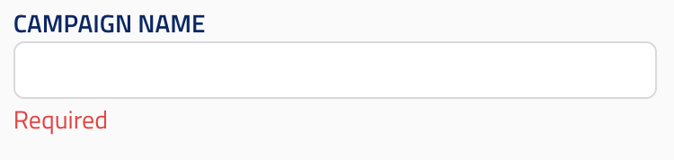

## String input

ui_element: `string_input`

Represents a simple input field.

The type should be `string`.

Reference schema: [string_input](reference_schemas/string_input.json)

### Example Pydantic implementation

```py
class Block:
    field: str = Field(min_length=1,
                      title="title",
                      description="description",
                    json_schema_extra={SchemaKey.UI_ELEMENT: UIElement.STRING_INPUT})
```

### UI design




## String list input

ui_element: `string_list_input`

Represents an input field where the user provides a list of strings.

The value must be a list of strings (and nothing else). This element is for a required
(non-nullable) list; for an optional list see [string_list_optional](#string-list-optional).

Reference schema: [string_list_input](reference_schemas/string_list_input.json)

### Example Pydantic implementation

```py
class Block:
    field: tuple[str, ...] = Field(
        default_factory=tuple,
        title="title",
        description="description",
        json_schema_extra={SchemaKey.UI_ELEMENT: UIElement.STRING_LIST_INPUT})
```

### UI design

(To be specified.)


## String list optional

ui_element: `string_list_optional`

Represents an input field where the user provides a list of strings, or leaves it unset (`null`).

The value must be a list of strings or `null` (and nothing else), e.g. `tuple[str, ...] | None`.

Reference schema: [string_list_optional](reference_schemas/string_list_optional.json)

### Example Pydantic implementation

```py
class Block:
    field: tuple[str, ...] | None = Field(
        default=None,
        title="title",
        description="description",
        json_schema_extra={SchemaKey.UI_ELEMENT: UIElement.STRING_LIST_OPTIONAL})
```

### UI design

(To be specified.)