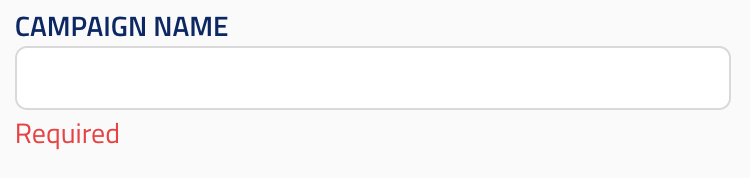

## String input

ui_element: `string_selection`

<!-- Represents a simple input field. -->

<!-- The type should be `string`. -->

Reference schema: [string_selection](reference_schemas/string_selection.json)

### Example Pydantic implementation

```py
class Block:
    field: str = Field(ui_element="string_input",
                      min_length=1,
                      title="title",
                      description="description")
```

### UI design




## TO BE ADDED: string_selection_parameter_sweep