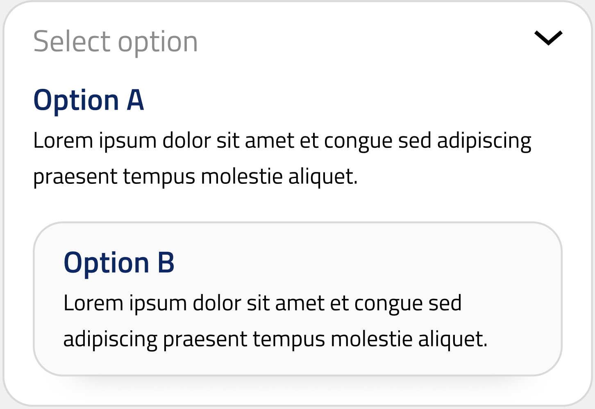
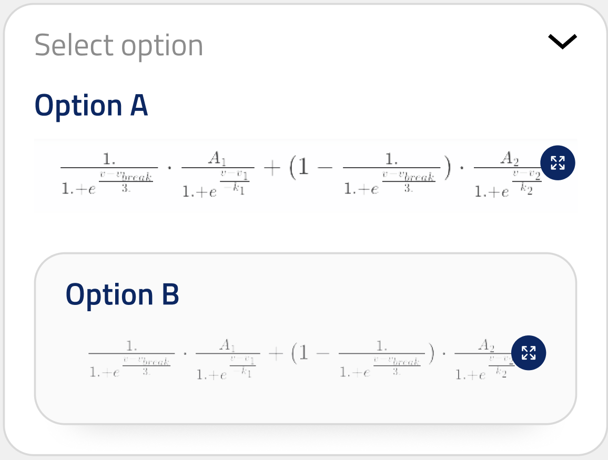
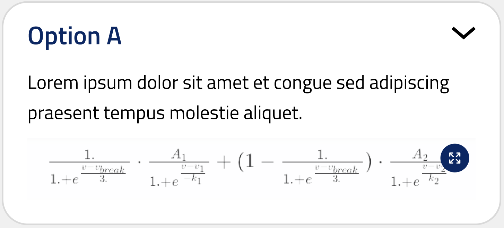

## String selection

ui_element: `string_selection`

<!-- Represents a simple input field. -->
<!-- The type should be `string`. -->

Reference schema: [string_selection](reference_schemas/string_selection.json)

### Example Pydantic implementation

```py
class Block:
    field: Literal["A", "B", "C"] = Field(
        title="Select A, B or C",
        description="Select option A, B or C.",
        default="A",
    )
```

### UI design

The design for string selection dropdown in the closed position:


And in the open position, showing one of the options selected:


## String selection extras

Several additional options are available for the presentation of string_selection elements. These only add to the presentation of the ui_element, and do not change the validatity of inputs. These extras do have implications for the validity of the schema, however. 

## String selection: description by keys

See the section of the [string_selection reference schema](reference_schemas/string_selection.json)

### Example Pydantic implementation

```py
class Block:
    field: Literal["A", "B", "C"] = Field(
        title="Select A, B or C",
        description="Select option A, B or C.",
        default="A",
        descriptions_by_key={'A': 'A is a ...', 
                            'B': 'B is a ...', 
                            'C': 'C is a ...'},
    )
```

### UI Design

The design for string selection dropdown with descriptions in the closed position:


And in the open position, showing one of the options selected:




## String selection: LaTeX by key

LaTeX equations by key can be specified in a similar manner as the descriptions by key. See [string_selection reference schema](reference_schemas/string_selection.json)

### Pydantic example implementation

```py
class Block:
    field: Literal["A", "B", "C"] = Field(
        title="Select A, B or C",
        description="Select option A, B or C.",
        default="A",
        latex_by_key={'A': 'A is a ...',
                    'B': 'B is a ...',
                    'C': 'C is a ...'}
    )
```

### UI Design

The design for string selection dropdown with descriptions by key in the closed position:


And in the open position, showing one of the options selected:



### String selection: Description and LaTeX by key 

Descriptions by key and LaTeX by key can be presented simultaneously if both are specified.

## UI Design

The design for string selection dropdown with latex by key and descriptions by key in the closed position:



And in the open position, showing one of the options selected:

