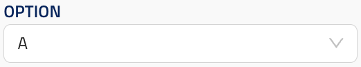
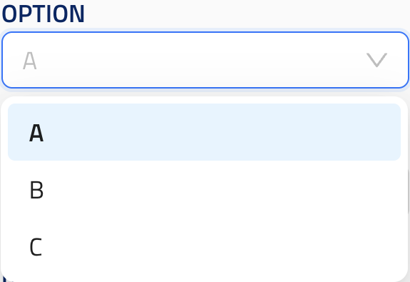

## String selection

ui_element: `string_selection_multi`

Reference schema: [string_selection_multi](reference_schemas/string_selection_multi.json)

### Example Pydantic implementation

```py
class Block:
    field: Literal["A", "B", "C"] = Field(
        title="Option",
        description="Option description.",
        default="A",
        json_schema_extra={
            "ui_element": "string_selection_multi
        }
    )
```

### UI design

The design for string selection dropdown in the closed position:



And in the open position, showing one of the options selected:

