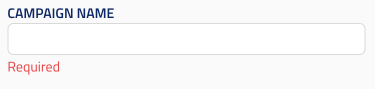

## String input

UIElement: `UIElement.STRING_INPUT`

Represents a simple input field.

The type should be `string`.

Reference schema: [string_input](reference_schemas/string_input.json)

### Example Pydantic implementation

```py
class Block:
    field: str = Field(min_length=1,
                      title="title",
                      description="description",
                    json_schema_extra={SchemaKey.UI_ELEMENT: UIElement.STRING_INPUT})
```

### UI design




## String Input Parameter Sweep (Placeholder, not yet supported)

UIElement: `UIElement.STRING_INPUT_PARAMETER_SWEEP`