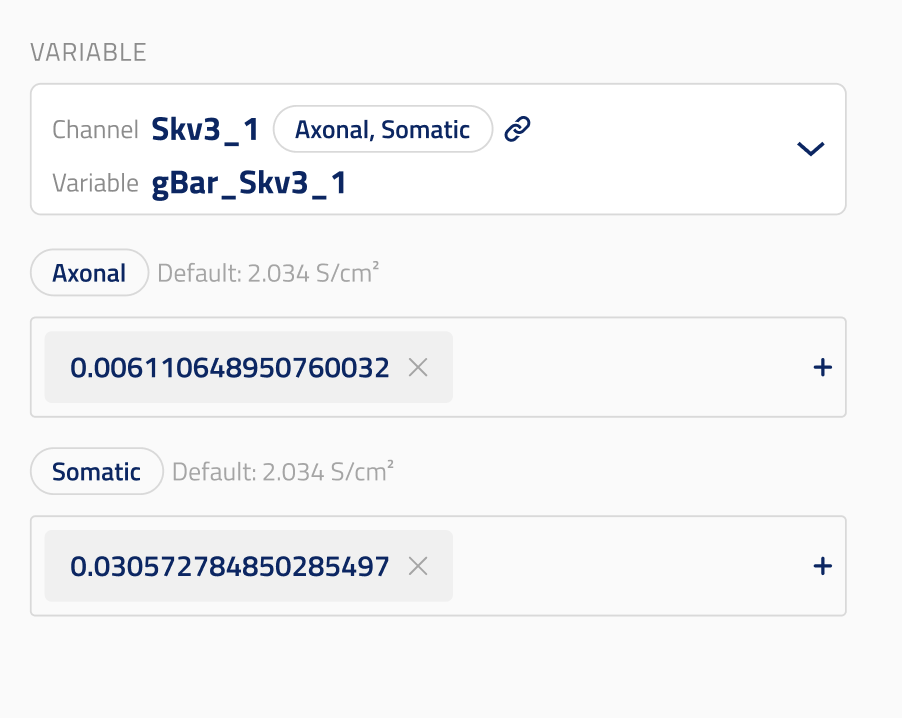

# Variable Modification

This UI element is used to modify ion channel variables (both RANGE and GLOBAL) in NEURON NMODL files. See [SONATA documentation](https://sonata-extension.readthedocs.io/en/latest/sonata_simulation.html#parameters-required-for-modifications) for more details.

- **RANGE variables** can vary across different sections of a neuron (e.g., `gCa_HVAbar_Ca_HVA2`, `gamma_CaDynamics_DC0`, `gSKv3_1bar_SKv3_1` and other variables declared as RANGE in ion channel mod files).
- **GLOBAL variables** apply uniformly to the entire neuron (e.g., reversal potentials like `ena_NaTg`, `ek_StochKv3`).

## Design



The UI presents a two-step flow:

- **Step 1**: A dropdown to select a variable. Variables are grouped by ion channel name. Each channel entry shows a link to the ion channel entity. Expanding a channel shows its available variables (both RANGE and GLOBAL).
- **Step 2**: A single numeric input is shown with the unit, as the value applies to the entire neuron (for GLOBAL) or to all sections uniformly (for RANGE). The original value from the MEModel is shown as a placeholder.

## `json_schema_extra` Properties

These properties are set on the `modification` field of `ByNeuronNeuronalParameterModification`:

- `ui_element`: Must be `"ion_channel_variable_modification"`.
- `title`: Title of the modification field shown in the UI.
- `description`: Description of the modification field shown in the UI.
- `property_group`: Must be `"Circuit"`. Used to look up available variables from the mapped circuit properties endpoint.
- `property`: Must be `"MechanismVariablesByIonChannel"`. Identifies which property from the `MechanismVariablesByIonChannel` response to use for populating the variable dropdown.

## Data Model

The `modification` field is a `ByNeuronModification` object:

- `ion_channel_id` (`uuid.UUID`): Entity ID of the selected ion channel. Set automatically when the user selects a variable.
- `channel_name` (`str`): Channel suffix (e.g., 'NaTg') used as key in conditions.mechanisms.
- `variable_name` (`str`): Name of the selected variable (e.g., `gamma_CaDynamics_DC0` for RANGE, `ena_NaTg` for GLOBAL).
- `variable_type` (`Literal["RANGE", "GLOBAL"]`): Type of variable, defaults to "GLOBAL".
- `new_value` (`float | list[float]`): New value(s) that applies to the entire neuron (for GLOBAL) or all sections (for RANGE).

## Code Example

```py
class ByNeuronNeuronalParameterModification(Block):
    """Modify ion channel variables (RANGE or GLOBAL) for specific neurons."""

    neuron_set: NeuronSetReference | None = Field(
        default=None,
        title="Neuron Set (Target)",
        description="Neuron set to which modification is applied.",
        exclude=True,
        json_schema_extra={"ui_hidden": True},
    )

    modification: ByNeuronModification = Field(
        title="Variable Modification",
        description="Ion channel variable modification (RANGE or GLOBAL).",
        json_schema_extra={
            "ui_element": "ion_channel_variable_modification",
            "property_group": MappedPropertiesGroup.CIRCUIT,   # "Circuit"
            "property": CircuitMappedProperties.MECHANISM_VARIABLES_BY_ION_CHANNEL,  # "MechanismVariablesByIonChannel"
        },
    )
```

## SONATA Output

### For RANGE Variables

Generates a single `configure_all_sections` entry in `conditions.modifications`:

```json
{
  "conditions": {
    "modifications": [
      {
        "name": "modify_gamma_CaDynamics_DC0_all",
        "node_set": "single",
        "type": "configure_all_sections",
        "section_configure": "%s.gamma_CaDynamics_DC0 = 0"
      }
    ]
  }
}
```

### For GLOBAL Variables

Generates a single entry in `conditions.mechanisms` keyed by channel name:

```json
{
  "conditions": {
    "mechanisms": {
      "NaTg": {
        "ena_NaTg": 50.0
      },
      "StochKv3": {
        "vmin_StochKv3": -80.0,
        "vmax_StochKv3": 40.0
      }
    }
  }
}
```
