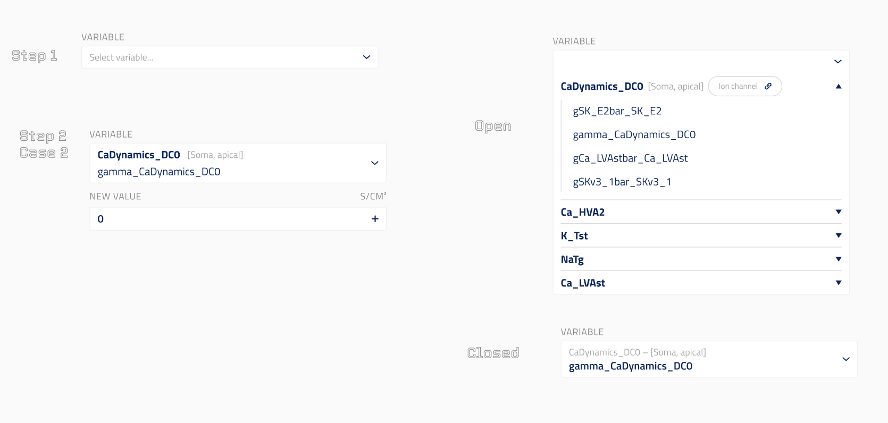

# Global Variable Modification

This UI element is used to modify GLOBAL NEURON NMODL (ion channel mod) file variables that apply uniformly to the entire neuron. See [SONATA documentation](https://sonata-extension.readthedocs.io/en/latest/sonata_simulation.html#parameters-required-for-modifications) for more details. GLOBAL variables are constant across all sections of a neuron (e.g., `gamma_CaDynamics_DC0`, `ena_NaTg` and other variables declared as GLOBAL in ion channel mod files).

## Design



The UI presents a two-step flow:

- **Step 1**: A dropdown to select a variable. Variables are grouped by ion channel name. Each channel entry shows its section lists (e.g., `CaDynamics_DC0 [Soma, apical]`) and a link to the ion channel entity. Expanding a channel shows its available GLOBAL variables.
- **Step 2 (Open)**: After selecting a variable, a single **NEW VALUE** numeric input is shown with its unit (e.g., S/CM²). Unlike RANGE variables, there is no per-section-list breakdown — the value applies to the whole neuron.
- **Step 2 (Closed)**: The selected variable is shown in a compact summary (e.g., `CaDynamics_DC0 — [Soma, apical] / gamma_CaDynamics_DC0`).

## `json_schema_extra` Properties

These properties are set on the `modification` field of `ByNeuronNeuronalParameterModification`:

- `ui_element`: Must be `"ion_channel_global_variable_modification"`.
- `title`: Title of the modification field shown in the UI.
- `description`: Description of the modification field shown in the UI.
- `property_group`: Must be `"Circuit"`. Used to look up available variables from the mapped circuit properties endpoint.
- `property`: Must be `"IonChannelGlobalVariables"`. Identifies which property from the `MechanismVariablesByIonChannel` response to use for populating the variable dropdown.

## Data Model

The `modification` field is a `ByNeuronModification` object:

- `ion_channel_id` (`str`): Entity ID of the selected ion channel. Set automatically when the user selects a variable.
- `channel_name` (`str`): Channel suffix used as the key in SONATA `conditions.mechanisms` (e.g., `NaTg`, `CaDynamics_DC0`). Set automatically when the user selects a variable.
- `variable_name` (`str`): Name of the selected GLOBAL variable (e.g., `gamma_CaDynamics_DC0`).
- `new_value` (`float | list[float]`): New value for the GLOBAL variable. A single float applies the same value to all neurons; a list applies per-neuron values.

## Code Example

```py
class ByNeuronNeuronalParameterModification(Block):
    """Modify GLOBAL variables of ion channels."""

    neuron_set: NeuronSetReference | None = Field(
        default=None,
        title="Neuron Set (Target)",
        description="Neuron set to which modification is applied.",
        exclude=True,
        json_schema_extra={"ui_hidden": True},
    )

    modification: ByNeuronModification = Field(
        title="GLOBAL Variable Modification",
        description="Ion channel GLOBAL variable modification.",
        json_schema_extra={
            "ui_element": "ion_channel_global_variable_modification",
            "property_group": MappedPropertiesGroup.CIRCUIT,   # "Circuit"
            "property": CircuitMappedProperties.ION_CHANNEL_GLOBAL_VARIABLES,  # "IonChannelGlobalVariables"
        },
    )
```

## SONATA Output

Generates a `conditions.mechanisms` entry keyed by channel suffix, containing the variable name and its new value:

```json
{
  "conditions": {
    "mechanisms": {
      "CaDynamics_DC0": {
        "gamma_CaDynamics_DC0": 0
      }
    }
  }
}
```

Multiple GLOBAL modifications to the same channel are merged under the same channel key:

```json
{
  "conditions": {
    "mechanisms": {
      "NaTg": {
        "ena_NaTg": 50.0,
        "vshifth_NaTg": -5.0
      }
    }
  }
}
```
