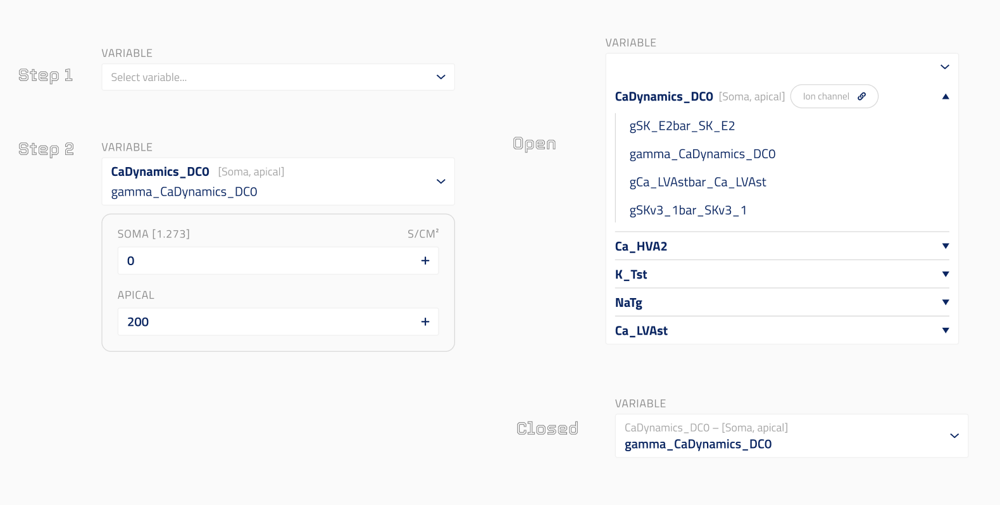

# Range Variable Modification

This UI element is used to modify RANGE NEURON NMODL (ion channel mod) file variables per section list. See [SONATA documentation](https://sonata-extension.readthedocs.io/en/latest/sonata_simulation.html#parameters-required-for-modifications) for more details. RANGE variables can vary across different sections of a neuron (e.g., `gCa_HVAbar_Ca_HVA2`, `gamma_CaDynamics_DC0`, `gSKv3_1bar_SKv3_1` and other variables declared as RANGE in ion channel mod files).

## Design



The UI presents a two-step flow:

- **Step 1**: A dropdown to select a variable. Variables are grouped by ion channel name. Each channel entry shows its section lists (e.g., `CaDynamics_DC0 [Soma, apical]`) and a link to the ion channel entity. Expanding a channel shows its available RANGE variables.
- **Step 2 (Open)**: After selecting a variable, one numeric input per section list is shown (e.g., SOMA, APICAL), each labelled with its unit (e.g., S/CM²). The original value from the MEModel is shown as a placeholder.
- **Step 2 (Closed)**: The selected variable is shown in a compact summary (e.g., `CaDynamics_DC0 — [Soma, apical] / gamma_CaDynamics_DC0`).

## `json_schema_extra` Properties

These properties are set on the `modification` field of `BySectionListNeuronalParameterModification`:

- `ui_element`: Must be `"ion_channel_range_variable_modification"`.
- `title`: Title of the modification field shown in the UI.
- `description`: Description of the modification field shown in the UI.
- `property_group`: Must be `"Circuit"`. Used to look up available variables from the mapped circuit properties endpoint.
- `property`: Must be `"IonChannelRangeVariables"`. Identifies which property from the `MechanismVariablesByIonChannel` response to use for populating the variable dropdown.

## Data Model

The `modification` field is a `BySectionListModification` object:

- `ion_channel_id` (`str`): Entity ID of the selected ion channel. Set automatically when the user selects a variable.
- `variable_name` (`str`): Name of the selected RANGE variable (e.g., `gamma_CaDynamics_DC0`).
- `section_list_modifications` (`dict[str, float | list[float]]`): Mapping of section list names to new values. Section lists are populated from the ion channel's available section lists. A list of floats can be used for per-compartment overrides.

## Code Example

```py
class BySectionListNeuronalParameterModification(Block):
    """Modify RANGE variables of ion channels for specific section lists."""

    neuron_set: NeuronSetReference | None = Field(
        default=None,
        title="Neuron Set (Target)",
        description="Neuron set to which modification is applied.",
        exclude=True,
        json_schema_extra={"ui_hidden": True},
    )

    modification: BySectionListModification = Field(
        title="RANGE Variable Modification",
        description="Ion channel RANGE variable modification by section list.",
        json_schema_extra={
            "ui_element": "ion_channel_range_variable_modification",
            "property_group": MappedPropertiesGroup.CIRCUIT,   # "Circuit"
            "property": CircuitMappedProperties.ION_CHANNEL_RANGE_VARIABLES,  # "IonChannelRangeVariables"
        },
    )
```

## SONATA Output

Generates one entry per section list in `conditions.modifications`. Multi-location aliases (e.g., `alldend`) are expanded to their concrete section lists:

```json
{
  "conditions": {
    "modifications": [
      {
        "name": "modify_gamma_CaDynamics_DC0_somatic",
        "node_set": "single",
        "type": "section_list",
        "section_configure": "somatic.gamma_CaDynamics_DC0 = 0"
      },
      {
        "name": "modify_gamma_CaDynamics_DC0_apical",
        "node_set": "single",
        "type": "section_list",
        "section_configure": "apical.gamma_CaDynamics_DC0 = 200"
      }
    ]
  }
}
```

For the special case of `section_list = "all"`, a `configure_all_sections` entry is generated instead:

```json
{
  "name": "modify_gamma_CaDynamics_DC0_all",
  "node_set": "single",
  "type": "configure_all_sections",
  "section_configure": "%s.gamma_CaDynamics_DC0 = 0"
}
```
