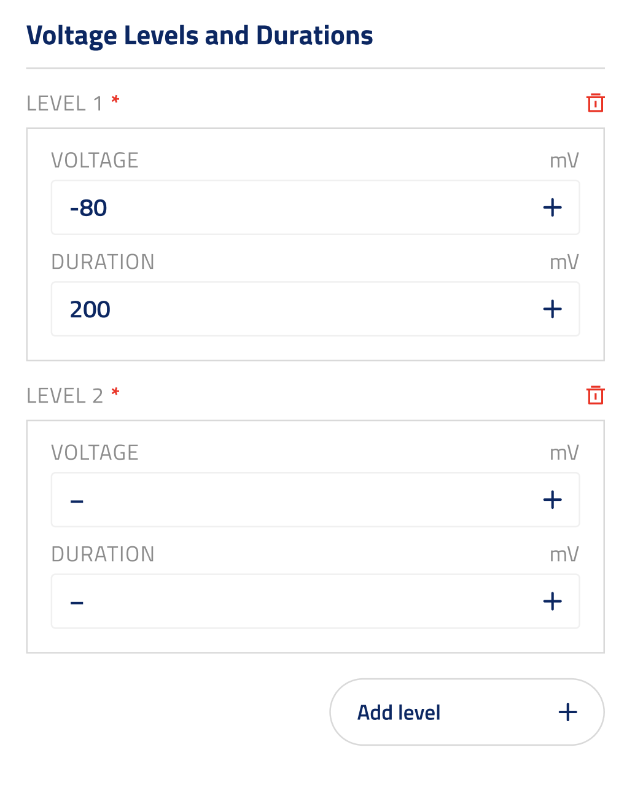

## Voltage duration UI element

ui_element: `voltage_duration_ui_element`

Reference schema [voltage_duration_ui_element](reference_schemas/voltage_duration_ui_element.json)


### UI design



The user can add new DurationVoltageCombination by clicking on a button.

They can delete any DurationVoltageCombination, unless there is only one left, in which case it cannot be deleted.


### Example Pydantic implementation

```py

class DurationVoltageCombination(ComplexVariableHolder):
    """Class for storing pairs of duration and voltage combinations for stimulation protocols."""

    voltage: float | list[float] = Field(
        title="Voltage for each level",
        description="The voltage for each level, given in millivolts (mV).",
        json_schema_extra={
            "unit": "mV",
        },
    )

    duration: NonNegativeFloat | list[NonNegativeFloat] = Field(
        title="Duration for each level",
        description="The duration for each level, given in milliseconds (ms).",
        json_schema_extra={
            "unit": "ms",
        },
    )


class Block:

    duration_voltage_combinations: list[DurationVoltageCombination] = Field(
        title="Voltage Levels and Durations",
        description="A list of duration and voltage combinations for the SEClamp stimulus. "
        "The first duration starts at time 0, "
        "and each subsequent duration starts when the previous one ends.",
        json_schema_extra={
            "ui_element": "voltage_duration_ui_element",
        },
    )
    
```
