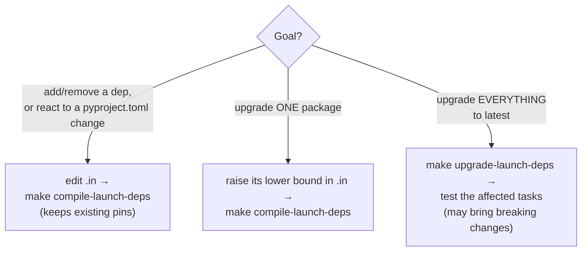
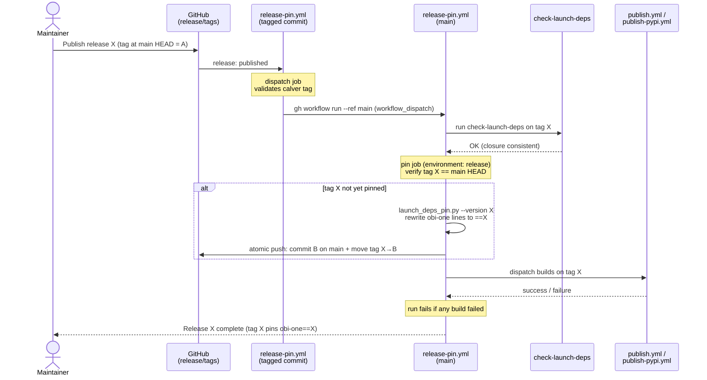

# Launch-script Dependencies

The scripts under [**launch_scripts/**](https://github.com/openbraininstitute/obi-one/tree/main/launch_scripts) run as tasks in the [launch-system](https://github.com/openbraininstitute/launch-system).
Each task installs a requirements file from `launch_scripts/<task>/dependencies/`.
The tools that manage these files are in `launch_scripts/tools/`.

Each requirements file has two versions:

- **`*.in`**: the source of truth. Edit this to add or change dependencies.
- **`*.txt`**: generated from the `*.in` and fully pinned. Do not edit by hand. The launch-system installs from it at task run time.

A task may additionally have an **`*.override`** file, pinning packages that its runtime image provides. See [Image overrides](#image-overrides).

## TL;DR for task developers

- **Add a task:** create `launch_scripts/<task>/dependencies/<name>.in` with a bare `obi-one[<extras>]` line (no version) plus any extra packages, run `make compile-launch-deps FILE=<path to the .in>`, and commit both the `*.in` and the generated `*.txt`. Tasks run by `launch_scripts/launch_task_for_single_config_asset/main.py` use `_obi_one_code("<name>.txt")` in `app/mappings.py`.
- **Change a task's dependencies:** edit its `*.in` (never the `*.txt`), compile it as above, and commit both files.
- **Change obi-one's own dependencies** (`pyproject.toml`): also run `make compile-launch-deps`, or `check-launch-deps` fails in CI.
- **Upgrade the pinned versions:** compiling never upgrades existing pins; raise a lower bound in the `*.in` for one package, or run `make upgrade-launch-deps FILE=<path to the .in>` for the whole closure, then test the task (see [Compiling](#compiling)).
- **Private packages** (CodeArtifact, e.g. `ultraliser`): add them to `PRIVATE_PACKAGES` in `launch_scripts/tools/launch_deps_compile.py` and set the CodeArtifact credentials before compiling (see [Compiling](#compiling)).
- **Pin a build that only exists in the runtime image** (e.g. the NEURON dev build of the neurodamus image): add a `<name>.override` file next to the `<name>.in`. Task developers don't touch it (see [Image overrides](#image-overrides)).
- **Don't touch the obi-one pin** (`obi-one[...]==X` in the `*.txt`): the release workflow updates it, and compiling keeps it.
- **Test a task against your branch's obi-one code:** see [Testing a task against an obi-one feature branch](#testing-a-task-against-an-obi-one-feature-branch), and revert the `*.txt` edit before merging.

## Compiling

The everyday developer loop for a task's dependencies is edit the `*.in`, compile to regenerate the `*.txt`, then check (locally or in CI) before committing both files. Which command to run depends on what you want to happen to the pins:



```bash
# Compile all launch-script requirements
make compile-launch-deps

# Compile a single .in file or a directory only
make compile-launch-deps FILE=launch_scripts/launch_task_for_single_config_asset/dependencies/circuit_extraction.in

# Upgrade the whole transitive closure to the latest versions (FILE also accepted)
make upgrade-launch-deps
```

This runs `uv pip compile` for the runtime platform (**linux/amd64, Python 3.12**) and pins the full transitive closure, compiling the files in parallel (`launch_deps_compile.py --jobs N`, default up to 8).
Like `make compile-deps`, `compile-launch-deps` **preserves the versions already pinned**, changing a pin only when the `*.in` (or obi-one's own requirements) forces it; `entitysdk` is the exception and is always upgraded to its latest version.
To upgrade one package, raise its lower bound in the `*.in` and compile. `make upgrade-launch-deps` refreshes the whole closure of the selected files, which can bring breaking changes, so test the affected tasks before merging.

`obi-one` itself is resolved from the local checkout, so its closure matches the current source, but it is not pinned by the resolver. Its line is written with the release pin found in the committed `*.txt` files (`obi-one[extras]==X` after release `X`, bare before the first release), and compiling keeps that pin. Only the release workflow changes it (see below). The obi-one lines of the `*.in` files must stay bare.

Some tasks depend on private packages from AWS CodeArtifact (currently `ultraliser`, used by `skeletonization` and `mesh_lod_generation`). The CodeArtifact index is used only for files that require a package listed in `PRIVATE_PACKAGES` (`launch_deps_compile.py`), directly or in their compiled `.txt`: it proxies PyPI but sends no caching headers, so using it everywhere makes every run slow. Add new private packages to that list. Compiling or checking these files needs `UV_INDEX_OBI_CODEARTIFACT_USERNAME=aws` and `UV_INDEX_OBI_CODEARTIFACT_PASSWORD` set to a CodeArtifact token (`aws codeartifact get-authorization-token --domain openbraininstitute --query authorizationToken --output text`).

## Image overrides

Some executor images ship a build that is not published on any index, such as the NEURON dev build of `python_3_12_openmpi5_neuron9_neurodamus` (`app/types.py`). Putting that version in the `*.in` would make the resolution unsatisfiable, so it goes in a sibling `*.override` file instead:

```
launch_scripts/launch_task_for_single_config_asset/dependencies/
  neurodamus_simulation.in         # obi-one[extras] + the task's own deps
  neurodamus_simulation.override   # versions the image provides
  neurodamus_simulation.txt        # generated
```

```
# neurodamus_simulation.override
# Provided by the python_3_12_openmpi5_neuron9_neurodamus launch-system image.
# Maintained with that image; not edited by task developers.
neuron==9.0.2.dev64
```

**`*.override` files are owned by the maintainers of the launch-system images**, and are updated when the image changes. A task developer editing the `*.in` never needs to touch one.

Compiling excludes the named packages from the resolver output (`--no-emit-package`) and writes the `*.override` requirements into the `*.txt` in their place, under a generated comment. The pins the resolver would otherwise preserve are also filtered, so an unpublishable version is never fed back as a resolution constraint. Editing an `*.override` makes its `*.txt` stale, and `make compile-launch-deps` regenerates it as usual.

The rest of the closure is still resolved against the version available on the index, so this suits a dev build of an already-resolvable package (NEURON dev builds share the dependencies of the matching release). For a package that nothing else in the closure requires, none of its dependencies would be pinned.

Only tasks whose `image_type` provides the build may have an `*.override`: the executor installs the requirements into the image's environment, where the pin is already satisfied. An `*.override` without a matching `*.in` is reported as an error, since it would override nothing.

## Checking

```bash
make check-launch-deps
```

CI runs the same check (`.github/workflows/check-launch-deps.yml`). Like `make check-deps`, it fails only when a committed `*.txt` is **inconsistent** with its `*.in` (or obi-one's requirements), not merely because newer upstream versions exist. If it reports stale files, run `make compile-launch-deps` and commit the result.

It resolves every task, including the private ones. Without CodeArtifact access, pass `FILE=<path>` to check only public tasks, or run `uv run python launch_scripts/tools/launch_deps_compile.py --check --skip-unresolvable` to skip, with a warning, any task that cannot be resolved.

## Releases

The release workflow is driven by `release-pin.yml`, which fires twice for one release: once on the `release: published` event (to re-dispatch itself on `main`) and once on the resulting `workflow_dispatch` run on `main` (to check, pin, move the tag and dispatch the builds).



Launch jobs check out the release tag `X`, whose requirements pin obi-one to that release.

### The release flow

1. A maintainer creates release `X` from the GitHub UI as usual (calver `YYYY.M.N`, e.g. `2026.9.15`), targeting `main` HEAD. This creates tag `X` at `main` HEAD, and nothing is built yet.
2. The release triggers `release-pin.yml` on the tagged commit. That run holds no credentials; its only job re-dispatches the workflow on `main` (see [Why two runs](#why-two-runs)).
3. The dispatched run (on `main`) first runs `check-launch-deps` on tag `X`, since the release fixes that commit's closure. It then checks that tag `X` is `main` HEAD, runs `launch_deps_pin.py --version X` to rewrite every obi-one line of `launch_scripts/*/dependencies/*.txt` to `obi-one[extras]==X`, verifies that nothing else changed, commits the result on `main` and moves tag `X` to that commit — in one atomic push with the `obi-one-release` GitHub App token (a bypass actor of the `main` ruleset).
4. It then dispatches the Docker (`publish.yml`) and PyPI (`publish-pypi.yml`) builds on tag `X` and waits for them. Both run only on a release tag whose obi-one lines are pinned to it (`launch_deps_pin.py --check`).
5. The service running version `X` submits jobs with `ref=tag:X` (`release_tag_ref` in `obi_one/utils/versions.py`), so the executor installs the obi-one `X` wheel together with the closure frozen at `X`.

Pinning only the obi-one line is consistent because `check-launch-deps` keeps `main`'s closure in sync with obi-one's requirements, so the closure committed at `X` was compiled against `X`'s source. Between releases, `main` keeps the pin of the last release.

### Why two runs

A `release: published` event runs the workflow file as it exists at the **tagged commit**, not on `main`. The `pin` job needs the `obi-one-release` App token (push to `main`, move tags), which must never be reachable from unreviewed workflow code. The `release` environment enforces this: it is restricted to `main` and does not allow tags. So the first run (on the tag) has no secrets and only re-dispatches the workflow on `main`; the second run (on `main`) runs reviewed code, can mint the token, and does the real work. The job `if` conditions implement the split (`dispatch` on the `release` event, `check-launch-deps` and `pin` on `workflow_dispatch`).

### Operational notes

- **Don't merge to `main` while a release is running:** the workflow fails if tag `X` is no longer `main` HEAD.
- **Required configuration:** the `release` environment with the variable `RELEASE_APP_CLIENT_ID` and the secret `RELEASE_APP_PRIVATE_KEY` of the `obi-one-release` GitHub App. Keep the environment restricted to `main` and never allow tags.
- **Try the pin locally, then revert** (this discards any local change to those files):

  ```bash
  make pin-launch-deps VERSION=2026.9.15
  git restore 'launch_scripts/*/dependencies/*.txt'
  ```

### Recovery

If `release-pin.yml` fails, the release is published but nothing is built, and tag `X` may still point at the unpinned commit. Fix the cause and re-run the failed run, or run the workflow on `main` from the Actions tab with the release tag as input: if the tag is already pinned, it only dispatches the builds. If only a build failed, re-run that build. If `check-launch-deps` fails on tag `X`, delete release `X` and its tag, fix `main` and release again.

## Testing a task against an obi-one feature branch

The launch-system executor clones obi-one from GitHub at the submitted `ref`, not from your local working copy, so any change it should use must be committed and pushed.
Without further changes, a job on a branch commit installs the branch's task script and requirements but the obi-one wheel of the last release, since branches keep `main`'s pin.

To also use the branch's obi-one library code:

1. On your feature branch, edit the task's `*.txt` obi-one line to a git reference, e.g. `obi-one[connectivity] @ git+https://github.com/openbraininstitute/obi-one.git@<branch-or-sha>`.
2. Commit and push, then submit the job with `ref=commit:<40-hex sha>` of that commit.
3. **Revert the `*.txt` edit before merging.** `make check-launch-deps` and CI flag it as stale, and the release workflow would fail, since `launch_deps_pin.py` refuses to pin an obi-one line that is neither bare nor pinned to a release.
