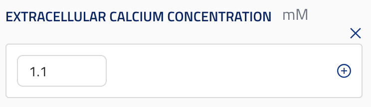
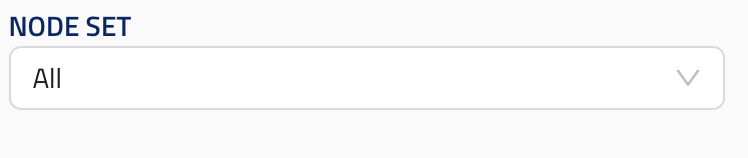

# Specification for JSONSchema GUI definition

## Scan configs

### ui_enabled

Scan configs intended for the UI require the `ui_enabled` (boolean) property. Setting this to `true` triggers the validation; only configs complying with the specification can be integrated into the UI.

The config is considered valid if its schema is valid and the schemas of all its root elements and block elements are valid.
All root elements and block elements must have a valid `ui_element`. [See below for details](#valid-ui_elements).

**If a config requires ui elements not specified in the current spec they must be added by defining a `ui_element` string, a reference schema and corresponding validation scripts, and a UI design**

### Constraints

All properties of a scan config must be _root elements_. (See below).

They should contain `group_order` property which must be an array of strings determining the order of groups of root elements. All values in `group_order` must be present in at least one root element's `group` string.

Optionally, they should contain a `default_block_element_labels` dictionary, specifying the labels for null references used in the config. If a `reference` used in the config isn't in this dictionary it will be hidden from the UI.

Reference schema: [scan_config](reference_schemas/scan_config.jsonc)

## ui_element

All _root elements_ and _block elements_ must include a `ui_element` string that maps the property to a specific UI component. Each `ui_element` identifier corresponds to a strict reference schema. Consequently, if two elements require different schema structures, they must use unique `ui_element` identifiers, even if they are functionally similar.

All ui_elements must contain a `title` and a `description`.

### Valid `ui_element`s

Root elements:

- `root_block`
- `block_dictionary`

Block elements:

- `string_input`
- `model_identifier`
- `float_parameter_sweep`
- `int_parameter_sweep`
- `reference`
- `entity_property_dropdown`

## Hidden elements

Setting the property `ui_hidden` to `true` will hide it from the UI. All hidden elements must have a `default`.

### Example

```py
class Block:
    field: str = Field(default="hidden input",  # Default must be present if ui_hidden==True
                        ui_hidden=True,
                        ui_element="string_input",
                        title="title",
                        description="description")
```

## Root elements

_root elements_ are the properties of scan configs they can be either _root blocks_ or _block dictionaries_ .

They should contain a `group` string that points to a string in its parent config's `group_order` array.

They should contain a `group_order` integer (unique within the group).

They should contain a `title` and a `description`.

## root_block

ui_element: `root_block`

Root blocks are blocks defined at the root level of a scan config.

They should contain `properties` in its schema which are _block_elements_.

Reference schema: [root_block](reference_schemas/root_block_schema.jsonc)

### Example Pydantic implementation

```py

class Info(Block):
    campaign_name: str = Field(
        ui_element="string_input",
        title="campaign name",
        description="Name of the campaign.")

class Config:

    info: Info = Field(
        ui_element="root_block",
        title="Title",
        description="Description",
        group="Group 1", # Must be present in its parent's config `group_order` array,
        group_order=0, # Unique within the group.
    )
```

## block_dictionary

ui_element: `block_dictionary`

- They should contain no `properties`
- They should contain `additionalProperties` with a single `oneOf` array with block schemas.
- They should contain a `singular_name`.
- They should contain a `reference_type`.

Reference schema: [block_dictionary](reference_schemas/block_dictionary.jsonc)

### Example Pydantic implementation

```py
class Config:

    ## SimulationNeuronSetUnion is a union of blocks (i.e. classes with block_elements)

    neuron_sets: dict[str, SimulationNeuronSetUnion] = Field(
        ui_element="block_dictionary",
        default_factory=dict,
        reference_type="NeuronSetReference",
        title="Neuron sets",
        description="Neuron sets for the simulation.",
        singular_name="Neuron Set",
        group="Group 1", # Must exit in parent config's `group_order` array
        group_order=0, # Unique within the group
    )

```

### UI design


## Block elements

Block elements are properties of blocks, they must have a `ui_element` property.
The parents of block elements must be blocks, never scan configs

They should contain a `title` and a `description`.

## String input

ui_element: `string_input`

Represents a simple input field.

The type should be `string`.

Reference schema: [string_input](reference_schemas/string_input.json)

### Example Pydantic implementation

```py
class Block:
    field: str = Field(ui_element="string_input",
                      min_length=1,
                      title="title",
                      description="description")
```

### UI design


## Model identifier

ui_element: `model_identifier`

- Should accept as input an object including an `id_str` string field.
- Should have a non-validating string field `primary_entity_parameter` specifying where in the config is `model_identifier` defined. (e.g. `initialize.circuit`)
- It follows from the above that this ui element can only be used in _root_blocks_, never in blocks within _block_dictionaries_.

Reference schema [model_identifier](reference_schemas/model_identifier.jsonc)

### Example Pydantic implementation

```py

class Circuit:
    pass

# Required
class CircuitFromId(OBIBaseModel):
    id_str: str = Field(description="ID of the entity in string format.")


class Block:
    circuit: Circuit | CircuitFromId = Field( # Other elements in the union other than `CircuitFromId` not required.
            ui_element="model_identifier",
            primary_entity_parameter="initialize.circuit",
            title="Circuit", description="Circuit to simulate."
        )
```

### UI design


## Float parameter sweep

ui_element: `float_parameter_sweep`

- Should have an `anyOf` property.
- Should accept a `number` and `number array`.
- _The single `number` value must come first_.
- Optional `minimum` and `maximum` and `default` in both cases.
- Optional `units` string.

Reference schema [float_parameter_sweep](reference_schemas/float_parameter_sweep.jsonc)

### Example Pydantic implementation

```py

class Block:

    extracellular_calcium_concentration:  NonNegativeFloat | list[NonNegativeFloat] = Field( # The single value must come first in the union
            ui_element="float_parameter_sweep",
            default=1.1,
            title="Extracellular Calcium Concentration",
            description=(
                "Extracellular calcium concentration",
            ),
            units="mM",
        )

```

### UI design



## Integer parameter sweep

ui_element: `int_parameter_sweep`

- Same as `parameter_sweep` but with `int` types in the `anyOf` array.

Reference schema [int_parameter_sweep](reference_schemas/int_parameter_sweep.json)

### Example Pydantic implementation

```py
class Block:
    random_seed: list[int] | int = Field(
            ui_element="int_parameter_sweep",
            default=1,
            title="Random seed"
            description="Random seed for the simulation."
        )

```

## Reference

ui_element: `reference`

- Should accept as input an `object` with `string` fields `block_name` and `block_dict_name`.
- Second element should be `null`.
- Should have a string (non-validating) `reference_type`, which is consitent with the type of the reference.
- They should have a `default` set to `null`.

_References are hidden from the ui if either the `ui_hidden` property is `True` or their `reference_type` is missing in its configuration's `default_block_reference_labels` [See](#constraints)_.

Reference schema [reference](reference_schemas/reference.json)

### Example Pydantic implementation

```py
class Block:
    node_set: NeuronSetReference | None = Field(default=None, #Must be present
                                                ui_element="reference",
                                                title="Neuron Set",
                                                description="Neuron set to simulate.",
                                                reference_type="NeuronSetReference")
```

### UI design


## Entity property dropdown

ui_element: `entity_property_dropdown`

- Should accept a single `string` as input.
- Should have an `entity_type` non-validating string.
- Should have a `property` non-validating string.

Reference schema [entity_property_dropdown](reference_schemas/entity_property_dropdown.json)

### Example Pydantic implementation

```py
CircuitNode = Annotated[str, Field(min_length=1)] # Required in the schema
NodeSetType = CircuitNode | list[CircuitNode] # list[] not required

class Block:
    node_set: Annotated[
        NodeSetType,
        Field(
            ui_element="entity_property_dropdown",
            entity_type="circuit",
            property="NodeSet",
            title="entity property dropdown",
            description="the description"
        ),
    ]
```

### UI design



## Legacy elements

## Neuron ids

ui_element: `neuron_ids`

This element's schema is particularly disordered, we have to keep it for legacy reasons (to avoid breaking changes to the schema). But it shouldn't be used in new configs.

Reference schema [neuron_ids](reference_schemas/neuron_ids.json)

Current pydantic implementation (`ui_element` added) for reference:

```py
class Block:
    neuron_ids: NamedTuple | list[NamedTuple] = Field(ui_element="neuron_ids", min_length=1, title="neuron ids", description="description")

```
