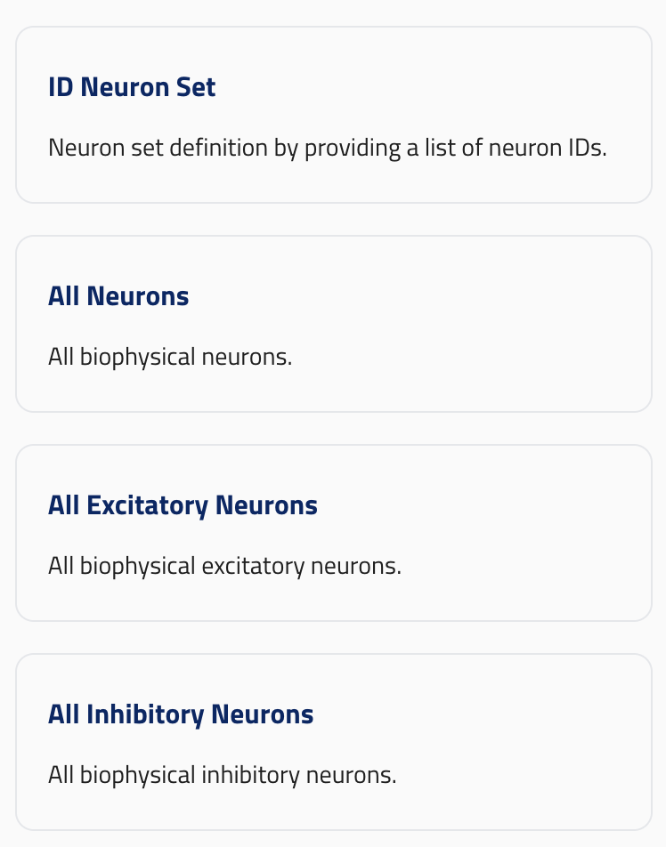

# Specification for JSONSchema GUI definition

## Forms

### ui_enabled

Forms intended for the UI require the `ui_enabled` (boolean) property. Setting this to `true` triggers the validation; only forms complying with the specification can be integrated into the UI.

The form is considered valid if the form schema is valid and the schemas of all its root elements and block elements are valid.
All root elements and block elements must have a valid `ui_element`. _See below for details_.

**If a form requires ui elements not specified in the current spec they must be added by defining a `ui_element` string, a reference schema and a UI design.**

### group_order

The `group_order` property must be an array of strings determining the order of groups. All values must be present in at least one root element's `group`.

### Constraints

All properties of a form must be _root elements_. (See below).

Reference schema: [form](reference_schemas/form.json)

## ui_element

All _root elements_ and _block elements_ must include a `ui_element` string (or `null` if hidden) that maps the property to a specific UI component. Each `ui_element` identifier corresponds to a strict reference schema. Consequently, if two components require different schema structures, they must use unique `ui_element` identifiers, even if they are functionally similar.

All ui_elements must contain a `title` and a `description`.

Valid `ui_element` values are:

All elements:

- `null`

Root elements:

- `root_block`
- `block_dictionary`

Block elements:

- `input`
- `model_identifier`
- `paramete_sweep`
- `int_parameter_sweep`
- `reference`
- `predefined_neuronset`

## Hidden elements

Setting an element's `ui_element` property to `null` will hide id from the UI. **They must not be required** (i.e have a `default`).

## Root elements

_root elements_ are the properties of forms they can be either _root blocks_ or _block dictionaries_ .

They should contain a `group` string that points to a string in its parent form's `group_order` array.

They should contain a `group_order` integer (unique within the form).

They should contain a `title` and a `description`.

## root_block

ui_element: `root_block`

Root blocks are blocks defined at the root level of a form.

They should contain `properties` in its schema which are _block_elements_.

Reference schema: [root_block](reference_schemas/root_block_schema.json)

### Example Pydantic implementation

```py

class Info(Block):
    campaign_name: str = Field(min_length=1, description="Name of the campaign.")
    campaign_description: str = Field(min_length=1, description="Description of the campaign.")

class Form:

    info: Info = Field(
        ui_element="root_block",
        title="Title",
        description="Description",
        group=BlockGroup.SETUP_BLOCK_GROUP,
        group_order=0,
    )
```

## block_dictionary

ui_element: `block_dictionary`

- They should contain no `properties`
- They should contain `additionalProperties` with a single `oneOf` array with block schemas.
- They should contain a `singular_name`.
- They should contain a `reference_type`.

Reference schema: [block_dictionary](reference_schemas/block_dictionary.json)

### Example Pydantic implementation

```py
class Form:
    neuron_sets: dict[str, SimulationNeuronSetUnion] = Field(
        ui_element="block_dictionary",
        default_factory=dict,
        reference_type=NeuronSetReference.__name__,
        description="Neuron sets for the simulation.",
        singular_name="Neuron Set",
        group=BlockGroup.CIRUIT_COMPONENTS_BLOCK_GROUP,
        group_order=0,
    )

```

### UI design



## Block elements

Block elements are properties of blocks, they (as _root elements_) must have a `ui_element` property.
The parents of block elements must be blocks, never forms.

They should contain a `title` and a `description`.

## Input

ui_element: `input`

Represents a simple input field.

The type should be `string`.

Reference schema: [input](reference_schemas/input.json)

### Example Pydantic implementation

```py
class Block:
    field: str = Field(ui_element="input", min_length=1, title="title" description="description")
```

### UI design


## Model identifier

ui_element: `model_identifier`

Should have a `type` property with a `const` value. (e.g `CircuitFromId`).
Should have an `id_str` property which accepts a string.

Reference schema [model_identifier](reference_schemas/model_identifier.json)

### Example Pydantic implementation

```py

class CircuitFromId(OBIBaseModel):
    id_str: str = Field(description="ID of the entity in string format.")


class Block:
    circuit: CircuitFromID = Field(
            title="Circuit", description="Circuit to simulate.", ui_element="model_identifier"
        )
```

### UI design


## Parameter sweep

ui_element: `parameter_sweep`

- Should have an `anyOf` property.
- Should accept either a `number` or `number array`.
- Optional `minimum` and `maximum` and `default` in both cases.

- Optional `units` string field.

Reference schema [parameter_sweep](reference_schemas/parameter_sweep.json)

### Example Pydantic implementation

```py

class Block:

    extracellular_calcium_concentration: list[NonNegativeFloat] | NonNegativeFloat = Field(
            ui_element="parameter_sweep",
            default=1.1,
            title="Extracellular Calcium Concentration",
            description=(
                "Extracellular calcium concentration",
            ),
            units="mM",
        )

```

### UI design


## Integer parameter sweep

ui_element: `int_parameter_sweep`

- Same as `parameter_sweep` but with `int` types in the `anyOf` array.

Reference schema [int_parameter_sweep](reference_schemas/int_parameter_sweep.json)

### Example Pydantic implementation

```py
class Block:
    random_seed: list[int] | int = Field(
            ui_element="int_parameter_sweep",
            default=1,
            title="Random seed"
            description="Random seed for the simulation."
        )

```

## Reference

ui_element: `reference`

- Should have an `anyOf` property.
  - First element should be an `object` with string fields `block_name` and `block_dict_name`.
  - First element should have a `type` property with a `const` value. (e.g `NeuronSetReference`).
  - Second element should be `null`.
  - **Order matters: null should always come last**

Reference schema [reference](reference_schemas/reference.json)

### Example Pydantic implementation

_Note: Placing `None` inside `Annotated` ensures the title and description on the parameter and not the inner reference object_

```py
class Block:
    node_set: Annotated[
            NeuronSetReference | None,
            Field(
                ui_element="reference",
                title="Neuron Set",
                description="Neuron set to simulate.",
            ),
        ] = None
```

### UI design


## Predefined neuron set

ui_element: `predefined_neuronset`

- Should accept as inputs either a single `string` or an `string array`.
- Should have an `entity_type` property which is a string (not a field of type string, i.e. a "non-validating" property)
- Should have a `property` property ("non-validating" string).

Reference schema [predefined_neuronset](reference_schemas/predefined_neuronset.json)

### Example Pydantic implementation


```py
CircuitNode = Annotated[str, Field(min_length=1)]
NodeSetType = CircuitNode | list[CircuitNode]

class Block:
    node_set: Annotated[
        NodeSetType,
        Field(
            ui_element="predefined_neuronset",
            min_length=1,
            entity_type="circuit",
            property="NodeSet",
            title="predefined neuronset",
            description="the description"
        ),
    ]
```

### UI design


## Legacy elements

## Neuron ids

ui_element: `neuron_ids`

This element's schema is particularly disordered, we have to keep it for legacy reasons (to avoid breaking changes to the schema). But it shouldn't be used in new forms.

Reference schema [neuron_ids](reference_schemas/neuron_ids.json)

Current pydantic implementation (`ui_element` added) for reference:

```py
class Block:
    neuron_ids: (
        NamedTuple | Annotated[list[NamedTuple], Field(ui_element="neuron_ids", min_length=1, description="description")]
    )

```
